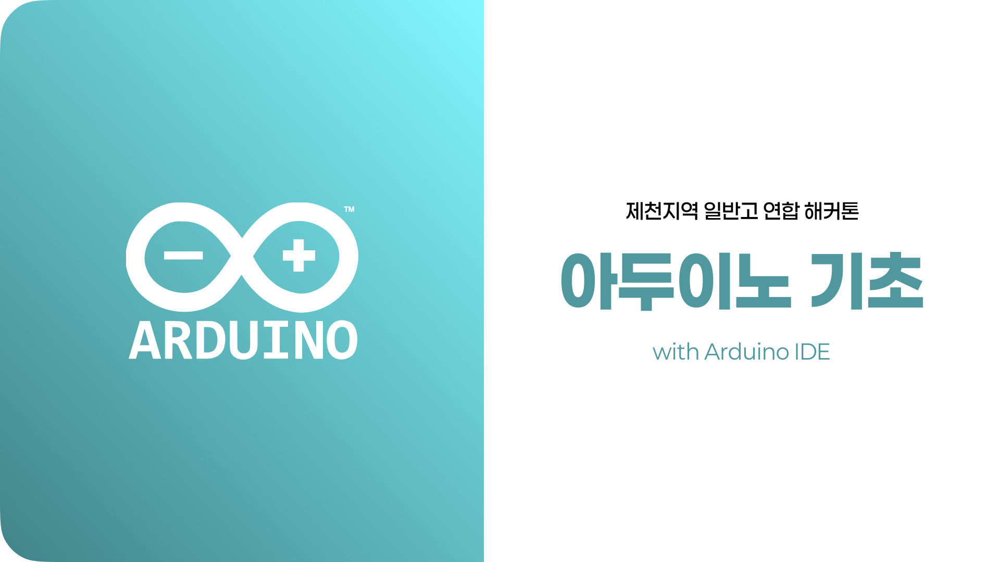

# 아두이노 기초 강의 (Arduino Basic Lecture)

본 강의 자료는 **2025 제천지역 일반고 연합 해커톤** 중 진행되는 교육용 자료로써, 고등학생(1~2학년)을 대상으로 아두이노 기초 개념과 센서·출력 장치 제어 방법을 학습하기 위해 제작되었습니다.

## 목차 (Table of Contents)

### **Chapter 1. 아두이노 기초 이해**

1. [아두이노란?](chapter-1-basic/01-What-is-Arduino.md)
2. [개발 환경 설정하기 (Arduino IDE)](chapter-1-basic/02-Setup-Arduino-IDE.md)
3. [아두이노 핀 구조와 기능](chapter-1-basic/03-Arduino-Pin-Structure.md)
4. [브레드보드 구조와 기능](chapter-1-basic/04-Breadboard-Architecture.md)

---

### **Chapter 2. 다양한 센서와 통신 방식**

1. [센서의 역할과 분류](chapter-2-sensor/01-Types-of-Sensors.md)
2. [디지털 vs 아날로그 신호](chapter-2-sensor/02-Digital-vs-Analog.md)
3. [아두이노와 센서의 연결 방식/선 종류](chapter-2-sensor/03-Arduino-Sensor-Wiring.md)
4. [아두이노와 센서 연결 예시](chapter-2-sensor/04-Connection-Examples.md)

---

### **Chapter 3. 기본 입출력 실습**

1. [신호등 LED 제어](chapter-3-io/01-Traffic-LED.md)
2. [3색 LED 제어](chapter-3-io/02-Output-LED.md)
3. [조도센서](chapter-3-io/03-Illumination-Sensor.md)
4. [초음파센서](chapter-3-io/04-Ultrasonic-Sensor.md)
5. [온/습도센서](chapter-3-io/05-Temperature-Humidity-Sensor.md)

---

### **Chapter 4. 고급 출력 장치 제어**

1. [수동부저 소리 재생](chapter-4-control/01-Analog-Input-Sensor.md)
2. [서보모터 회전 제어](chapter-4-control/02-Servo-Motor.md)
3. [I2C LCD 화면 출력](chapter-4-control/03-I2C-LCD.md)
4. [7세그먼트 숫자 출력](chapter-4-control/04-Seven-Segment.md)

---

### **Chapter 5. 아두이노에서 주의할 여러 점들**

1. [코드 업로드 오류](chapter-05-errors/01-Upload-Error.md)

- 보드/포트 설정 문제, 케이블 불량 또는 연결 불량, 드라이버 설치 문제

1. [시리얼 모니터 값이 이상하게 나오는 경우](chapter-05-errors/02-Serial-Monitor-Issue.md)

   - 통신 속도(baud rate) 불일치, 센서 연결 문제

2. [센서 값이 변하지 않는 경우](chapter-05-errors/03-Sensor-Value-Issue.md)

   - 핀 번호 오류, 전원/그라운드 연결 누락, 센서 손상 여부 확인

3. [아두이노/LED/부저 등 장치가 동작하지 않는 경우](chapter-05-errors/04-Device-Issue.md)

   - 극성(+) (-) 반대로 연결, 전압 부족, 코드 로직 오류

4. [서보모터 떨림 또는 움직이지 않음](chapter-05-errors/05-Servo-Motor-Issue.md)

   - 전원 공급 문제, PWM 핀 확인, 코드 딜레이 설정 문제

5. [I2C 장치(LCD 등) 화면이 안 나오는 경우](chapter-05-errors/06-I2C-Device-Issue.md)

   - SDA/SCL 핀 연결 확인, I2C 주소 확인 및 변경 방법, 라이브러리 설치 여부 확인

6. [기타 예상치 못한 오류 상황](chapter-05-errors/07-Misc-Error.md)
   - 리셋 버튼 활용, 코드 최소화하여 원인 추적, 공식 문서 및 커뮤니티 검색 방법
