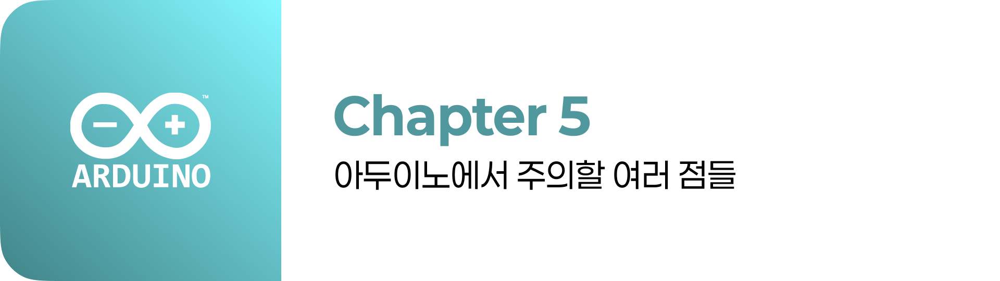

# 아두이노/LED/부저 등 장치가 동작하지 않는 경우

> [!WARNING]
> 이 문서는 **코드를 업로드했지만 LED, 부저, 모터 등 출력 장치가 전혀 반응하지 않는 문제**의 해결 방법에 대해 설명합니다.

## 1. 오류 현상

- `digitalWrite(ledPin, HIGH);` 코드를 실행해도 LED에 불이 들어오지 않습니다.
- `tone(buzzerPin, 262);` 코드를 실행해도 부저에서 소리가 나지 않습니다.
- 서보 모터나 DC 모터가 전혀 움직이지 않습니다.

## 2. 주요 원인 및 해결 방법

### 원인 1: 극성(+/-)을 반대로 연결한 경우

> LED, 다이오드, 커패시터, 부저, IC 등 극성이 있는 부품을 반대로 연결하면 동작하지 않거나 부품이 손상될 수 있습니다.

**해결 방법**

- **부품의 극성 확인**: 
  - **LED**: 긴 다리가 양극(+), 짧은 다리가 음극(-)입니다.
  - **부저**: `+` 표시가 있는 쪽이 양극입니다.
  - **커패시터**: 흰색 띠가 있는 쪽이 음극(-)입니다.
- **회로 재확인**: 양극은 아두이노의 출력 핀(또는 5V)에, 음극은 GND에 올바르게 연결되었는지 확인합니다.

### 원인 2: 전류 부족 또는 전압 부족

> 여러 개의 LED나 모터와 같이 상대적으로 많은 전류를 소모하는 부품을 동시에 동작시키려 할 때, 아두이노 보드의 5V 핀에서 공급하는 전류만으로는 부족할 수 있습니다.

**해결 방법**

1. **외부 전원 사용**: 모터, 다수의 LED 스트립 등 많은 전류를 필요로 하는 부품은 아두이노 전원이 아닌, 별도의 어댑터나 배터리 팩과 같은 외부 전원을 사용해야 합니다. 이때, **외부 전원의 GND와 아두이노의 GND는 반드시 공통으로 연결**해야 합니다.
2. **동작 전압 확인**: 사용하는 부품이 5V가 아닌 3.3V 또는 그 이상의 전압에서 동작하는지 확인하고, 올바른 전압을 공급해야 합니다.

### 원인 3: 코드 로직 오류

> 회로에는 문제가 없지만, 코드의 논리적인 흐름이 잘못되어 출력 명령이 실행되지 않는 경우입니다.

**해결 방법**

1. **`pinMode()` 설정 확인**: `setup()` 함수 내에서 해당 핀을 `pinMode(pin, OUTPUT);`으로 올바르게 설정했는지 확인합니다.
2. **조건문 확인**: `if`문과 같은 조건문 안에 출력 코드가 있다면, 해당 조건이 실제로 참(true)이 되는지 `Serial.print()`등을 이용해 중간 과정을 출력하며 확인합니다.
3. **함수 호출 확인**: 직접 만든 함수 안에 출력 코드가 있다면, `loop()` 함수 등에서 해당 함수가 정상적으로 호출되는지 확인합니다.

### 원인 4: 저항 미사용 또는 잘못된 저항 사용

> LED에 전류 제한 저항 없이 직접 5V를 연결하면 LED가 즉시 타버릴 수 있습니다. 반대로 너무 큰 저항을 연결하면 전류가 약해져 불이 켜지지 않거나 매우 어둡게 켜집니다.

**해결 방법**

- **적절한 저항 사용**: LED에는 보통 220Ω ~ 1kΩ 사이의 저항을 직렬로 연결하는 것이 일반적입니다. 부품에 맞는 적절한 저항을 사용했는지 확인합니다.
