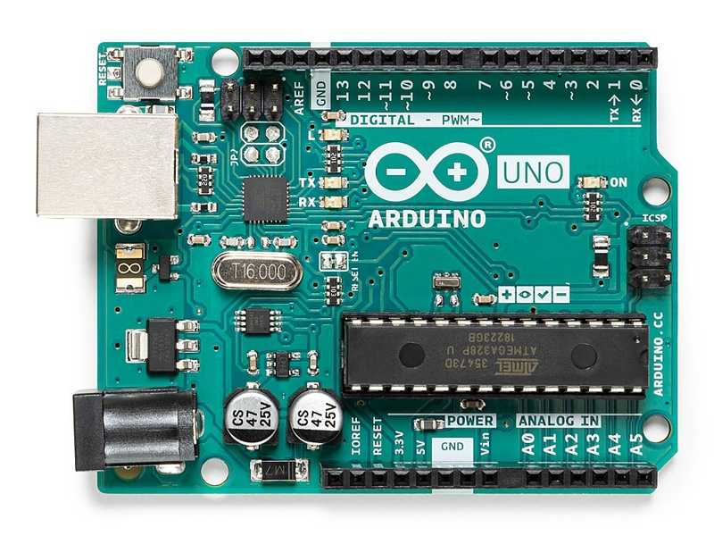

# 아두이노란? (What is Arduino?)

> [!NOTE]
> 이 문서는 **아두이노(Arduino)**에 대해 설명합니다.

## 1. 아두이노란?

오픈 소스를 기반으로 한 단일 보드 마이크로컨트롤러로 완성 된 보드와 관련 개발 도구 및 환경을 의미합니다.



> 가장 대중적인 아두이노 우노 보드

### 특징

- 저렴한 가격
- 간편한 개발 환경
- 오픈 소스 하드웨어 및 소프트웨어
- 다양한 센서 및 부품과의 호환성

### 기술 사양 (공식 아두이노 우노 기준)

| 항목             | 값                         |
| ---------------- | -------------------------- |
| 마이크로컨트롤러 | ATmega328P                 |
| 동작 전압        | 5V                         |
| 입력 전압 (권장) | 7-12V                      |
| 디지털 I/O 핀    | 14개 (6개는 PWM 출력 가능) |
| 아날로그 입력 핀 | 6개                        |
| 플래시 메모리    | 32KB                       |
| SRAM             | 2KB                        |
| EEPROM           | 1KB                        |
| 클럭 속도        | 16MHz                      |

## 2. 아두이노 프로그래밍의 기본 구조

```cpp
void setup() {
  // 코드를 실행하기 전, 처음에 한 번만 실행됩니다.
  // 핀 모드를 설정하거나, 라이브러리를 초기화하는 데 사용됩니다.
}

void loop() {
  // setup() 함수가 실행된 후, 계속해서 반복적으로 실행됩니다.
  // 아두이노의 주요 기능이 이 곳에 작성됩니다.
}
```
