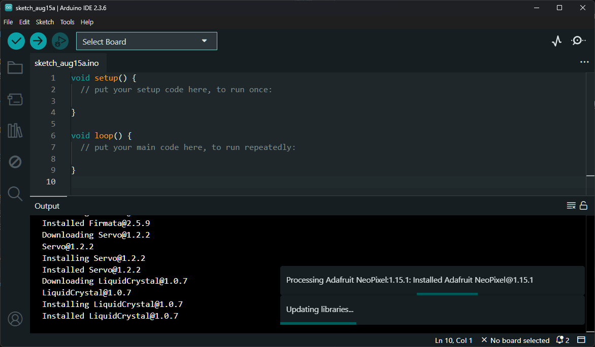

# 개발 환경 설정하기 (Arduino IDE)

> [!NOTE]
> 이 문서는 **아두이노 통합 개발 환경(IDE)** 설정 방법에 대해 설명합니다.

## 1. 아두이노 IDE란?

아두이노 보드에 코드를 작성하고 업로드하기 위한 공식 소프트웨어입니다.



> 아두이노 IDE 2.x 버전의 인터페이스

### 주요 기능

- 코드 에디터: C/C++ 기반의 아두이노 코드를 작성하는 공간
- 시리얼 모니터: 아두이노 보드와 시리얼 통신을 통해 데이터를 주고받는 기능
- 라이브러리 매니저: 다양한 추가 기능을 쉽게 설치하고 관리
- 보드 매니저: 아두이노 공식 보드 외 다른 보드를 추가하고 관리

## 2. 아두이노 IDE 설치 과정

1. **[공식 홈페이지](https://www.arduino.cc/en/software) 접속**
2. **자신의 운영체제에 맞는 버전 다운로드**
   - Windows, macOS, Linux 등 다양한 OS 지원
3. **설치 파일 실행 및 설치 진행**
   - 설치 중 드라이버 설치 동의 창이 나타나면 '예'를 클릭하여 설치. (모든 것을 `설치`, `동의`, `예` 등의 긍정적인 선택)

## 3. 아두이노 보드 연결 및 설정

1. **아두이노 보드와 PC를 USB 케이블로 연결**
2. **아두이노 IDE 실행**
3. **보드 선택**
   - `툴` > `보드` 메뉴에서 자신의 아두이노 보드 선택 (예: Arduino Uno)
4. **포트 선택**
   - `툴` > `포트` 메뉴에서 아두이노가 연결된 COM 포트 선택

## 4. 기본 예제 코드 업로드 테스트

```cpp
void setup() {
  Serial.begin(9600); // 9600 bps 속도로 시리얼 통신 시작
}

void loop() {
  Serial.println("Hello, Arduino!"); // "Hello, Arduino!" 메시지 출력
  delay(1000); // 1초 대기 (ms)
}
```

> 위 코드를 업로드한 후, IDE 우측 상단의 돋보기 아이콘(시리얼 모니터)을 클릭하면 1초마다 메시지가 출력되는 것을 확인할 수 있습니다.

> [!TIP]
> 2초마다 메시지가 출력되도록 수정해보세요!
