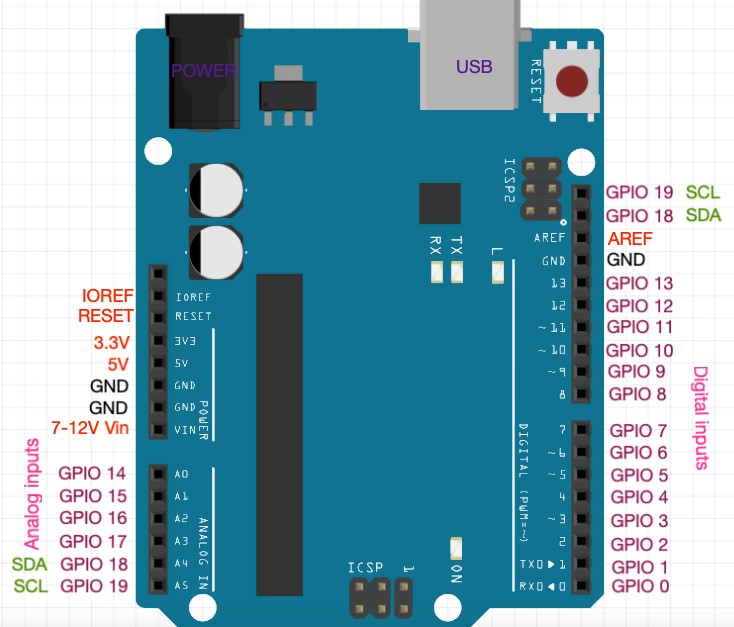

# 아두이노 핀 구조와 기능

> [!NOTE]
> 이 문서는 **아두이노 우노(Uno) 보드**의 핀 구조와 기능에 대해 설명합니다.

## 1. 아두이노 핀의 종류

> 아두이노 보드는 다양한 종류의 핀을 통해 외부 전자 부품과 상호작용합니다.



> 아두이노 우노 보드의 핀 배치도

### 전원 핀 (Power Pins)

| 핀 이름 | 기능 |
|---|---|
| 3.3V | 3.3V 전원 공급 |
| 5V | 5V 전원 공급 |
| GND | 접지(Ground) 핀 |
| VIN | 외부 전원 입력 (7-12V) |

### 아날로그 핀 (Analog Pins)

- **A0 ~ A5**: 아날로그 신호를 입력받는 핀 (0 ~ 1023 사이의 값으로 변환)
- 조도 센서, 가변 저항 등 아날로그 센서 연결에 사용

### 디지털 핀 (Digital Pins)

- **0 ~ 13**: 디지털 신호(HIGH/LOW)를 입/출력하는 핀
- LED, 스위치, 부저 등 디지털 부품 연결에 사용
- **PWM (Pulse Width Modulation)**: `~` 표시가 있는 핀(3, 5, 6, 9, 10, 11)은 아날로그 출력 효과를 낼 수 있음 (예: LED 밝기 조절, 모터 속도 제어)
- **특수 기능 핀**:
  - **0 (RX), 1 (TX)**: 시리얼 통신에 사용
  - **2, 3**: 외부 인터럽트(Interrupt) 사용 가능
  - **10 (SS), 11 (MOSI), 12 (MISO), 13 (SCK)**: SPI 통신에 사용
  - **SDA, SCL**: I2C 통신에 사용

## 2. 핀 모드(Pin Mode) 설정

> `setup()` 함수 내에서 `pinMode()` 함수를 사용하여 각 핀의 역할을 설정해야 합니다.

```cpp
int ledPin = 13;
int buttonPin = 7;

void setup() {
  pinMode(ledPin, OUTPUT);     // 13번 핀을 출력으로 설정
  pinMode(buttonPin, INPUT);     // 7번 핀을 입력으로 설정
  // pinMode(buttonPin, INPUT_PULLUP); // 내부 풀업 저항을 사용하는 입력으로 설정
}

void loop() {
  // ...
}
```
