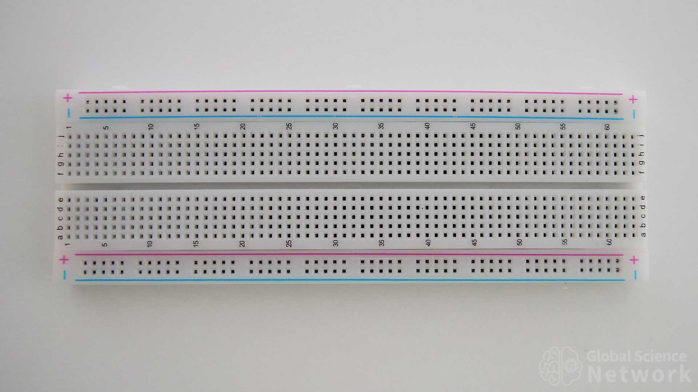
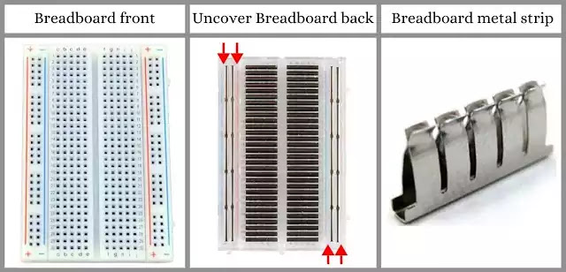
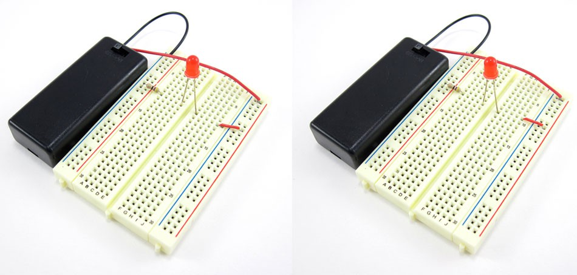

# 브레드보드 구조와 기능

> [!NOTE]
> 이 문서는 **브레드보드(Breadboard)**의 구조와 사용 방법에 대해 설명합니다.

## 1. 브레드보드란?

납땜 없이 전자 부품과 전선을 쉽게 꽂아 회로를 구성할 수 있는 실험용 기판입니다. (마치 콘센트에 코드를 꽂는 것처럼)



> 일반적인 풀사이즈 브레드보드

### 특징

- 프로토타이핑에 용이
- 부품 재사용 가능
- 회로 변경 및 수정이 간편

## 2. 브레드보드의 내부 구조

브레드보드 내부는 금속 클립으로 연결되어 있어, 특정 규칙에 따라 전기가 통합니다.



> 브레드보드의 내부 연결 구조

### 전원 버스 (Power Rails)

- 브레드보드 양쪽 가장자리에 위치한 **빨간색**과 **파란색** 라인
- **세로 방향**으로 길게 연결되어 있음
- 주로 전원(VCC)과 접지(GND)를 연결하여 회로 전체에 쉽게 공급하는 용도로 사용

### 단자 스트립 (Terminal Strips)

- 브레드보드 중앙에 위치한 구멍들
- **가로 방향**으로 5개씩 짧게 연결되어 있음
- 중앙의 홈을 기준으로 위아래가 분리되어 있음
- 전자 부품(IC, 저항, LED 등)의 다리를 꽂아 서로 연결하는 데 사용

## 3. 브레드보드 사용 예시

LED와 저항을 연결하는 간단한 회로 예시입니다.



```cpp
// 아두이노 코드
void setup() {
  pinMode(13, OUTPUT); // 13번 핀을 출력으로 설정
}

void loop() {
  digitalWrite(13, HIGH); // LED 켜기
}
```

1. 아두이노의 **5V** 핀을 브레드보드의 **빨간색 전원 버스**에 연결합니다.
2. 아두이노의 **GND** 핀을 브레드보드의 **파란색 전원 버스**에 연결합니다.
3. **저항**의 한쪽 다리를 **단자 스트립**에 꽂습니다.
4. **LED의 긴 다리(양극)**를 저항과 같은 가로 라인에 꽂습니다.
5. **LED의 짧은 다리(음극)**를 다른 가로 라인에 꽂고, 그 라인을 **파란색 전원 버스(GND)**에 연결합니다.
6. 아두이노의 **13번 핀**을 저항의 다른 쪽 다리와 같은 가로 라인에 연결합니다.
