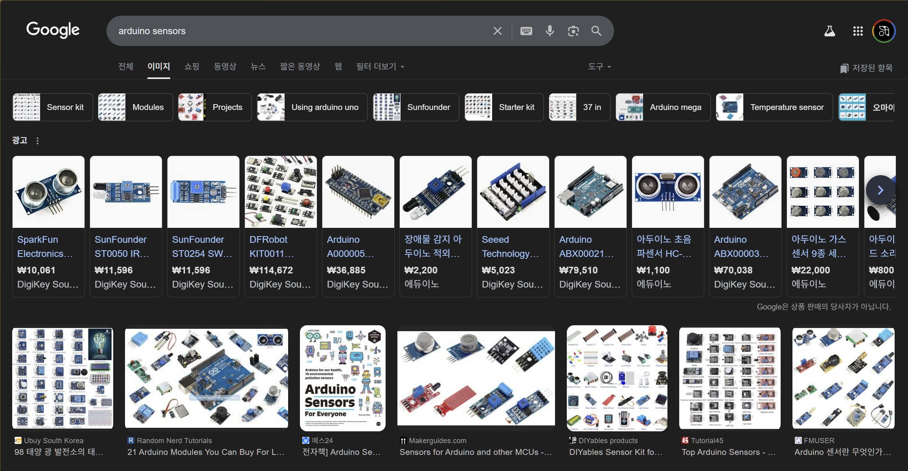

# 센서의 역할과 분류

> [!NOTE]
> 이 문서는 **아두이노에서 사용되는 센서**의 역할과 종류에 대해 설명합니다.

## 1. 센서(Sensor)란?

> 물리적 또는 환경적 변화를 감지하여 전기적 신호로 변환하는 장치입니다.



> 아두이노에서 자주 사용되는 다양한 센서들

### 센서의 역할

- **데이터 수집**: 주변 환경(온도, 습도, 밝기, 거리 등)의 정보를 수집합니다.
- **상호작용**: 사용자의 입력(버튼, 터치)이나 움직임을 감지하여 시스템과 상호작용합니다.
- **자동 제어**: 특정 조건(예: 어두워지면 조명 켜기)을 감지하여 시스템이 자동으로 동작하게 합니다.

## 2. 센서의 분류

### 입력 신호에 따른 분류

| 구분 | 설명 | 예시 |
|---|---|---|
| **아날로그 센서** | 연속적인 값을 출력하는 센서 | 조도 센서, 온도 센서(TMP36), 가변 저항 |
| **디지털 센서** | 특정 상태(ON/OFF, HIGH/LOW)를 출력하는 센서 | 버튼, 적외선 장애물 감지 센서, PIR 인체 감지 센서 |

### 측정 대상에 따른 분류

- **환경 센서**: 온도, 습도, 기압, 미세먼지, 가스 등
- **광학 센서**: 밝기(조도), 색상, 적외선 등
- **음향 센서**: 소리 크기, 주파수 등
- **기계적 센서**: 압력, 힘, 가속도, 자이로, 거리(초음파) 등
- **생체 센서**: 심박수, 지문 등

## 3. 아두이노와 센서 연결

> 대부분의 센서는 VCC(전원), GND(접지), SIG(신호) 3개의 핀으로 구성됩니다.

```cpp
// 조도 센서 값 읽기 예시
int sensorPin = A0; // 아날로그 0번 핀에 센서 연결

void setup() {
  Serial.begin(9600);
}

void loop() {
  int sensorValue = analogRead(sensorPin); // 센서 값 읽기
  Serial.println(sensorValue); // 시리얼 모니터에 출력
  delay(100);
}
```
