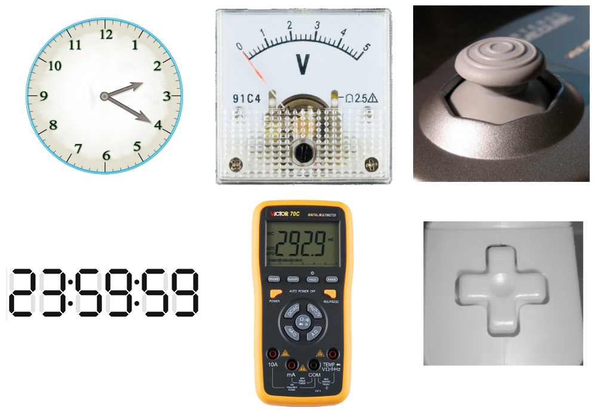
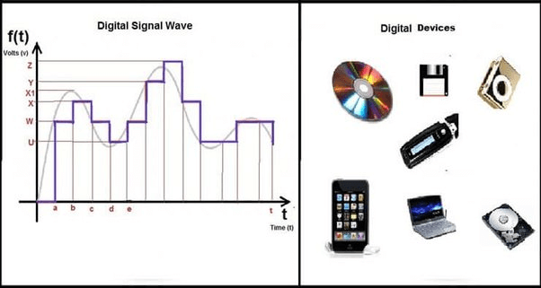

# 디지털 vs 아날로그 신호

> [!NOTE]
> 이 문서는 **디지털(Digital) 신호**와 **아날로그(Analog) 신호**의 차이점에 대해 설명합니다.



## 1. 신호(Signal)란?

> 정보를 전달하기 위한 전기적 또는 물리적 표현입니다. 아두이노에서는 주로 전압의 형태로 신호를 다룹니다.



> 아날로그 신호(위)와 디지털 신호(아래)의 파형 비교

## 2. 아날로그 신호 (Analog Signal)

> 연속적인 값을 가지는 신호입니다.

### 특징

- **연속성**: 신호의 크기가 끊기지 않고 연속적으로 변합니다.
- **정밀성**: 이론적으로 무한한 정밀도를 가질 수 있습니다.
- **외부 영향**: 노이즈(Noise)에 취약하여 신호가 왜곡되기 쉽습니다.
- **예시**: 목소리, 빛의 밝기, 온도의 변화 등 자연계의 대부분의 신호

### 아두이노에서의 아날로그 입력

- `analogRead()` 함수를 사용하여 아날로그 핀(A0~A5)으로 들어오는 신호를 읽습니다.
- 0V ~ 5V 사이의 전압을 0 ~ 1023 사이의 정수 값으로 변환하여 반환합니다.

```cpp
int sensorPin = A0;

void setup() {
  Serial.begin(9600);
}

void loop() {
  int sensorValue = analogRead(sensorPin); // 0~1023 사이의 값
  Serial.println(sensorValue);
  delay(100);
}
```

## 3. 디지털 신호 (Digital Signal)

> 이산적인 값(두 가지 상태)을 가지는 신호입니다.

### 특징

- **이산성**: 0과 1, 또는 LOW와 HIGH 두 가지 상태만 존재합니다.
- **명확성**: 신호의 상태가 명확하게 구분됩니다.
- **내구성**: 노이즈에 강하여 데이터의 신뢰도가 높습니다.
- **예시**: 스위치의 ON/OFF 상태, 컴퓨터의 데이터 처리(0과 1)

### 아두이노에서의 디지털 입출력

- `digitalRead()` 함수로 디지털 핀의 상태(HIGH 또는 LOW)를 읽습니다.
- `digitalWrite()` 함수로 디지털 핀에 HIGH(5V) 또는 LOW(0V) 신호를 출력합니다.

```cpp
int ledPin = 13;
int buttonPin = 7;

void setup() {
  pinMode(ledPin, OUTPUT);
  pinMode(buttonPin, INPUT);
}

void loop() {
  int buttonState = digitalRead(buttonPin);
  if (buttonState == HIGH) {
    digitalWrite(ledPin, HIGH);
  } else {
    digitalWrite(ledPin, LOW);
  }
}
```
