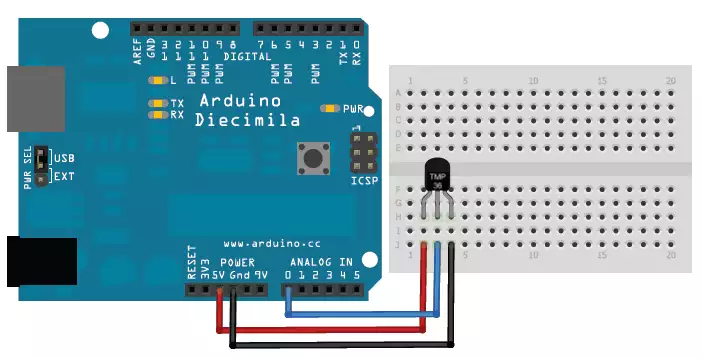
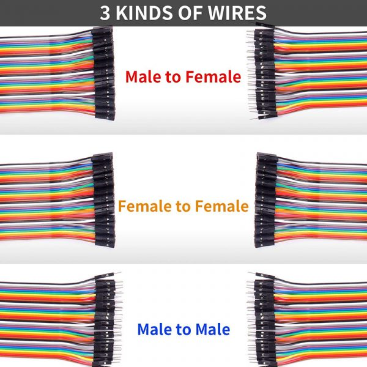

# 아두이노와 센서의 연결 방식/선 종류

> [!NOTE]
> 이 문서는 **아두이노와 센서를 연결**하는 기본적인 방법과 사용되는 전선 종류에 대해 설명합니다.

## 1. 기본적인 센서 연결

> 대부분의 센서 모듈은 3개 또는 4개의 핀을 가지고 있으며, 아두이노와 다음과 같이 연결됩니다.

> 일반적인 3핀 센서(온도 센서)의 연결 예시

### 필수 연결 핀

| 핀 이름              | 설명         | 아두이노 연결 핀        |
| -------------------- | ------------ | ----------------------- |
| **VCC** 또는 **5V**  | 전원 공급 핀 | `5V`                    |
| **GND**              | 접지 핀      | `GND`                   |
| **SIG** 또는 **OUT** | 신호 출력 핀 | 디지털 또는 아날로그 핀 |

### 추가 기능 핀 (센서에 따라 존재)

- **EN (Enable)**: 센서 동작을 활성화/비활성화하는 핀
- **SDA/SCL**: I2C 통신용 핀
- **TX/RX**: UART 시리얼 통신용 핀

## 2. 사용되는 전선(점퍼 와이어)의 종류

> 브레드보드와 아두이노, 센서를 연결할 때 주로 점퍼 와이어(Jumper Wire)를 사용합니다.

> 세 가지 종류의 점퍼 와이어

### 종류 및 용도

| 종류                         | 형태                           | 주요 용도                                      |
| ---------------------------- | ------------------------------ | ---------------------------------------------- |
| **수-수 (Male-to-Male)**     | 양쪽 끝이 튀어나온 핀 형태     | 브레드보드 내부 연결, 아두이노-브레드보드 연결 |
| **수-암 (Male-to-Female)**   | 한쪽은 핀, 다른 쪽은 소켓 형태 | 아두이노 핀과 센서 모듈 핀 직접 연결           |
| **암-암 (Female-to-Female)** | 양쪽 끝이 소켓 형태            | 핀 헤더가 있는 모듈 간의 연결                  |

## 3. 연결 시 주의사항

> [!NOTE]
>
> [Chapter 5](/README.md#chapter-5-아두이노에서-주의할-여러-점들)에서 다양한 연결 오류에 대해 설명합니다.

- **전원 극성 확인**: VCC와 GND를 반대로 연결하지 않도록 주의합니다. 부품이 손상될 수 있습니다.
- **전압 확인**: 센서가 요구하는 동작 전압(5V 또는 3.3V)을 확인하고 아두이노의 해당 전원 핀에 연결합니다.
- **신호 핀 확인**: 아날로그 센서는 아날로그 핀(A0-A5)에, 디지털 센서는 디지털 핀에 연결합니다.
- **결선 상태 확인**: 선이 헐겁게 연결되지 않았는지 확인합니다. 불안정한 연결은 오작동의 원인이 됩니다.
