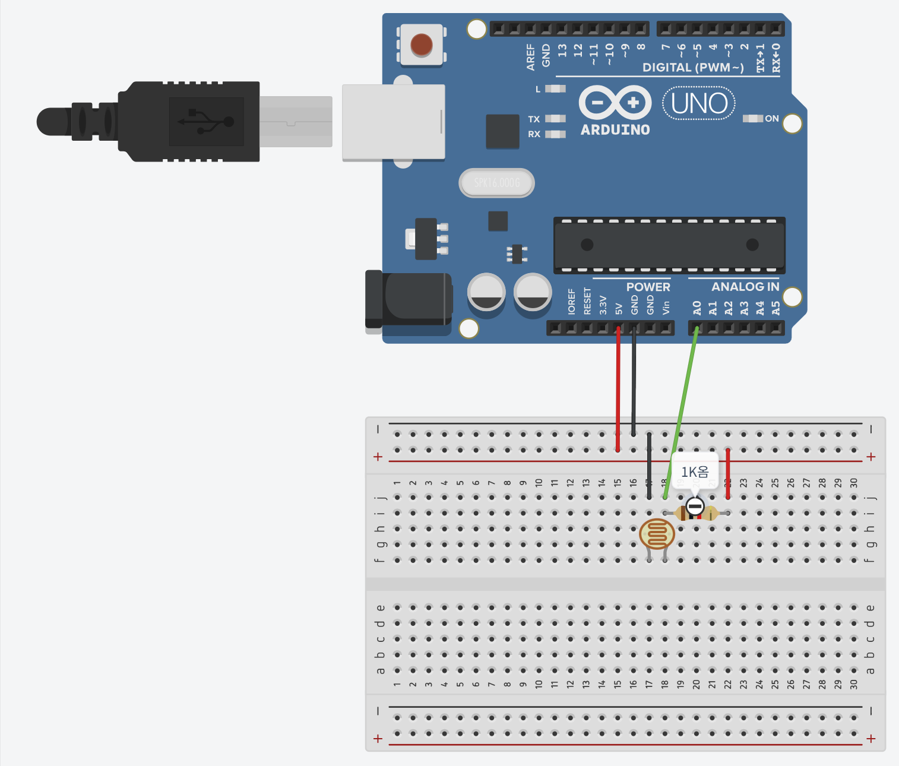
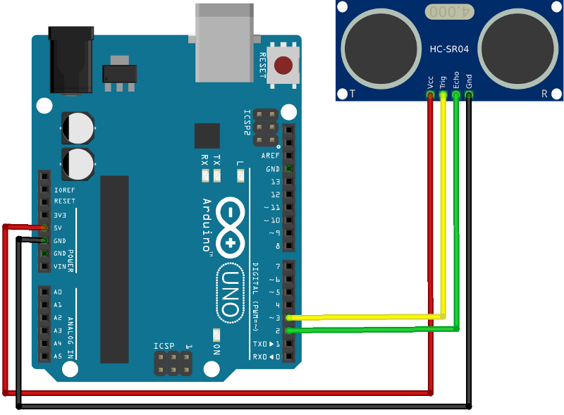
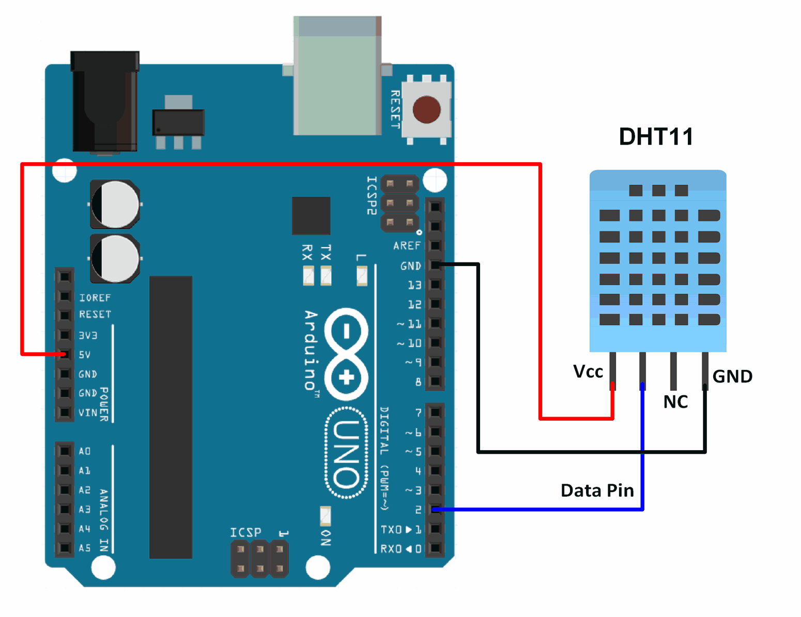

# 아두이노와 센서 연결 예시

> [!NOTE]
> 이 문서는 **대표적인 아두이노 센서**들의 연결 예시를 보여줍니다.

## 1. 조도 센서 (Analog)

> 빛의 밝기를 감지하는 아날로그 센서입니다.



> [!TIP]
> 시각적으로 연결 회로를 빠르게 판단하기 위해 **VCC는 빨간색**, **GND는 검정색** 케이블로 연결합니다.

| 센서 핀 | 아두이노 연결 핀   |
| ------- | ------------------ |
| VCC     | `5V`               |
| GND     | `GND`              |
| SIG     | `A0` (아날로그 핀) |

```cpp
int cdsPin = A0;
void setup() {
  Serial.begin(9600);
}
void loop() {
  int value = analogRead(cdsPin);
  Serial.println(value);
  delay(200);
}
```

## 2. 초음파 센서 (Digital)

> 초음파를 이용해 거리를 측정하는 디지털 센서입니다.



| 센서 핀 | 아두이노 연결 핀 |
| ------- | ---------------- |
| VCC     | `5V`             |
| GND     | `GND`            |
| Trig    | `2` (디지털 핀)  |
| Echo    | `3` (디지털 핀)  |

```cpp
// 변수 이름은 꼭 직관적이게 지어야합니다.
// a, aa, aaa 처럼 지으면 나중에 구분하기 어렵겠죠?
int trigPin = 2;
int echoPin = 3;
void setup() {
  Serial.begin(9600);
  pinMode(trigPin, OUTPUT);
  pinMode(echoPin, INPUT);
}
void loop() {
  digitalWrite(trigPin, LOW);
  delayMicroseconds(2);
  digitalWrite(trigPin, HIGH);
  delayMicroseconds(10);
  digitalWrite(trigPin, LOW);
  long duration = pulseIn(echoPin, HIGH);
  int distance = duration * 0.034 / 2;
  Serial.print(distance);
  Serial.println(" cm");
  delay(500);
}
```

## 3. 온습도 센서 (Digital, DHT11)

> 온도와 습도를 함께 측정하는 디지털 센서입니다. (별도의 라이브러리 필요)



| 센서 핀 | 아두이노 연결 핀 |
| ------- | ---------------- |
| VCC     | `5V`             |
| GND     | `GND`            |
| DATA    | `2` (디지털 핀)  |

```cpp
#include "DHT.h"
#define DHTPIN 2
#define DHTTYPE DHT11
DHT dht(DHTPIN, DHTTYPE);

void setup() {
  Serial.begin(9600);
  dht.begin();
}

void loop() {
  float h = dht.readHumidity();
  float t = dht.readTemperature();
  if (isnan(h) || isnan(t)) {
    Serial.println("Failed to read from DHT sensor!");
    return;
  }
  Serial.print("Humidity: ");
  Serial.print(h);
  Serial.print(" %\t");
  Serial.print("Temperature: ");
  Serial.print(t);
  Serial.println(" *C");
  delay(2000);
}
```
