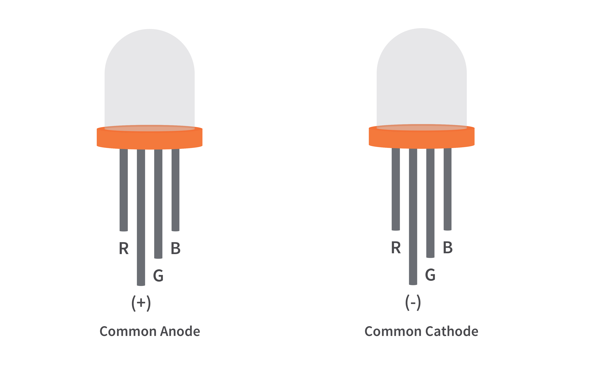
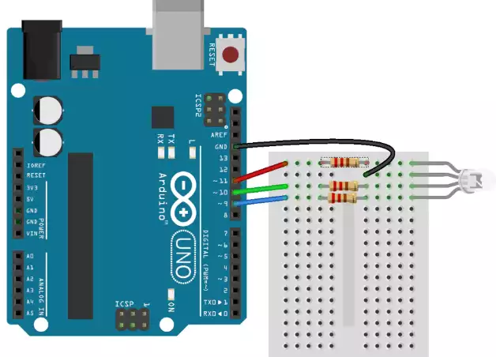

# RGB LED 제어

> [!NOTE]
> 이 문서는 **3가지 색(빨강, 초록, 파랑)이 들어있는 3색 LED(RGB LED)**를 제어하는 실습에 대해 설명합니다.



> [!WARNING]
> 본인의 RGB LED가 어떤 형태인지 먼저 확인해야합니다.

## 1. 실습 목표

> 3색 LED를 이용하여 다양한 색상을 조합하고 표현하는 방법을 학습합니다.



> 3색 LED(공통 음극 타입) 회로 구성 예시

### 준비물

- 아두이노 우노
- 브레드보드
- 3색 LED (RGB LED, 공통 음극 타입)
- 220Ω 저항 3개
- 점퍼 와이어

## 2. 3색 LED란?

> 빛의 삼원색인 빨강(Red), 초록(Green), 파랑(Blue) LED가 하나의 패키지에 합쳐진 부품입니다. 각 색의 밝기를 조절하여 다양한 색상을 만들 수 있습니다.

- **공통 양극(Common Anode)**: 공통 핀을 VCC에 연결. 각 색상 핀에 LOW 신호를 주면 해당 색상이 켜짐.
- **공통 음극(Common Cathode)**: 공통 핀을 GND에 연결. 각 색상 핀에 HIGH 신호를 주면 해당 색상이 켜짐. (본 실습에서는 공통 음극 사용)

## 3. 회로 구성 (공통 음극 기준)

1. 3색 LED의 가장 긴 다리(공통 음극)를 아두이노의 **GND**에 연결합니다.
2. 빨강(R) 핀을 220Ω 저항을 거쳐 아두이노 디지털 **9번** 핀(PWM)에 연결합니다.
3. 초록(G) 핀을 220Ω 저항을 거쳐 아두이노 디지털 **10번** 핀(PWM)에 연결합니다.
4. 파랑(B) 핀을 220Ω 저항을 거쳐 아두이노 디지털 **11번** 핀(PWM)에 연결합니다.

## 4. 코드 작성

> `analogWrite()` 함수를 사용하여 각 색상의 밝기를 0~255 단계로 조절합니다.

```cpp
int redPin = 9;
int greenPin = 10;
int bluePin = 11;

void setup() {
  pinMode(redPin, OUTPUT);
  pinMode(greenPin, OUTPUT);
  pinMode(bluePin, OUTPUT);
}

void loop() {
  setColor(255, 0, 0); // 빨강색
  delay(1000);
  setColor(0, 255, 0); // 초록색
  delay(1000);
  setColor(0, 0, 255); // 파랑색
  delay(1000);
  setColor(255, 255, 0); // 노랑색 (빨강 + 초록)
  delay(1000);
  setColor(128, 0, 128); // 보라색 (빨강 + 파랑)
  delay(1000);
  setColor(0, 255, 255); // 청록색 (초록 + 파랑)
  delay(1000);
  setColor(255, 255, 255); // 흰색 (모든 색상)
  delay(1000);
}

void setColor(int red, int green, int blue) {
  analogWrite(redPin, red);
  analogWrite(greenPin, green);
  analogWrite(bluePin, blue);
}
```

> [!IMPORTANT]
> 신호등 LED에서는 저항을 사용하지 않았는데 왜 RGB LED는 저항을 사용했을까요? 겉모습을 보며 이유를 생각해봐요.
