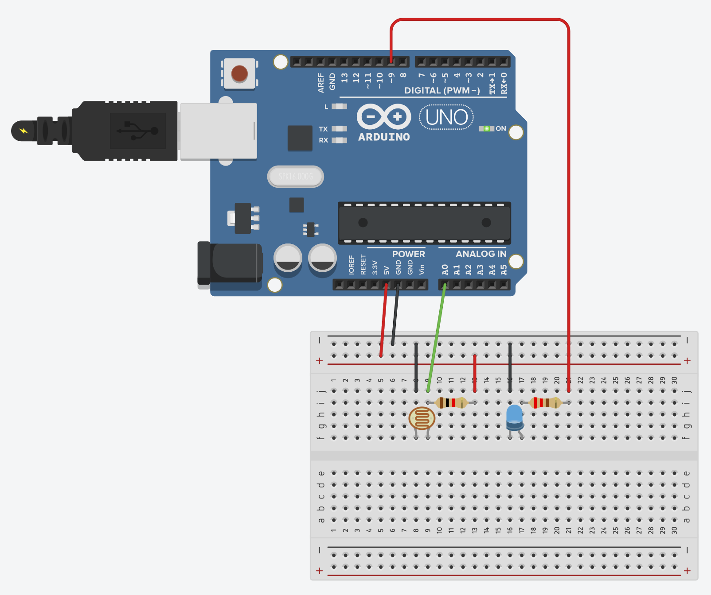

# 조도센서

> [!NOTE]
> 이 문서는 **조도 센서(CdS, Photoresistor)**를 사용하여 빛의 밝기를 측정하는 실습에 대해 설명합니다.

## 1. 실습 목표

> 조도 센서의 값을 아날로그 입력으로 읽어와 시리얼 모니터에 출력하고, 특정 밝기 값에 따라 LED를 제어합니다.



> 조도 센서와 LED를 함께 사용한 회로 예시

### 준비물

- 아두이노 우노
- 브레드보드
- 조도 센서 (CdS)
- 10kΩ 저항 1개 (풀다운 저항용)
- LED 1개
- 220Ω 저항 1개 (LED 보호용)
- 점퍼 와이어

## 2. 조도 센서(CdS)란?

> 빛의 양에 따라 저항값이 변하는 소자입니다. **밝을수록 저항이 낮아지고, 어두울수록 저항이 높아집니다.** 아두이노는 저항값을 직접 읽을 수 없으므로, **전압 분배 법칙**을 이용하여 변화하는 전압을 측정합니다.

## 3. 회로 구성

1. 아두이노 **5V** 핀을 브레드보드의 한쪽 단자 스트립 라인에 연결합니다.
2. 조도 센서의 한쪽 다리를 위에서 연결한 5V 라인에 연결합니다.
3. 조도 센서의 다른 쪽 다리를 아두이노 **A0** 핀과 10kΩ 저항의 한쪽 끝에 함께 연결합니다.
4. 10kΩ 저항의 다른 쪽 끝을 아두이노 **GND**에 연결합니다. (풀다운 저항)
5. LED의 긴 다리를 220Ω 저항을 거쳐 아두이노 디지털 **9번** 핀에 연결합니다.
6. LED의 짧은 다리를 아두이노 **GND**에 연결합니다.

## 4. 코드 작성

> 조도 센서 값에 따라 LED가 켜지고 꺼지도록 코드를 작성합니다.

```cpp
int cdsPin = A0;
int ledPin = 9;

void setup() {
  Serial.begin(9600);
  pinMode(ledPin, OUTPUT);
}

void loop() {
  int sensorValue = analogRead(cdsPin);
  Serial.println(sensorValue);

  // 어두워지면(센서 값이 특정 값 이하이면) LED 켜기
  // 기준값(예: 300)은 주변 환경에 따라 조절 필요
  if (sensorValue < 300) {
    digitalWrite(ledPin, HIGH); // LED 켜기
  } else {
    digitalWrite(ledPin, LOW);  // LED 끄기
  }

  delay(100);
}
```

### 동작 설명

1. `analogRead(cdsPin)`를 통해 조도 센서의 아날로그 값을 읽어옵니다.
2. 읽어온 값은 시리얼 모니터에 출력됩니다. (주변 밝기에 따라 값이 어떻게 변하는지 확인)
3. `if` 문을 사용하여 센서 값이 300보다 작아지면(어두워지면) 9번 핀에 연결된 LED가 켜지고, 그렇지 않으면(밝으면) 꺼집니다.
