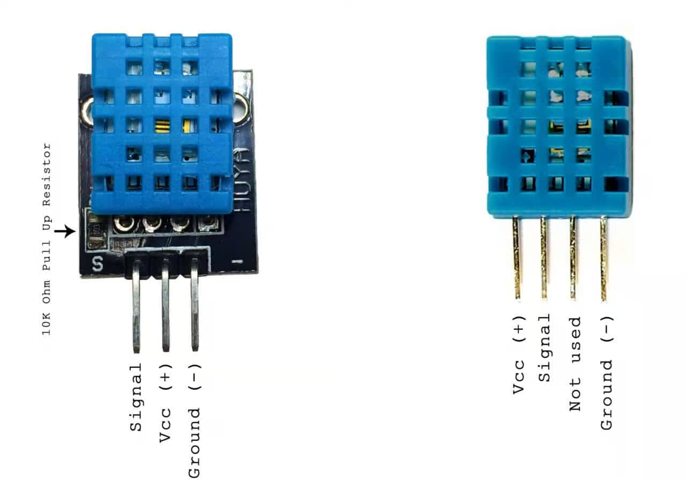

# 온/습도센서

> [!NOTE]
> 이 문서는 **온/습도 센서(DHT11)**를 사용하여 온도와 습도를 측정하는 실습에 대해 설명합니다.

## 1. 실습 목표

> DHT11 온/습도 센서를 아두이노에 연결하고, 관련 라이브러리를 설치하여 온도와 습도 값을 시리얼 모니터에 출력합니다.



> DHT11에 10K 저항이 달려있는 경우도 있으니 확인

### 준비물

- 아두이노 우노
- 브레드보드
- 온/습도 센서 (DHT11)
- 점퍼 와이어
- (필요시) 10kΩ 저항 1개 (풀업 저항용, 모듈에 내장된 경우 생략 가능)

## 2. DHT11 센서란?

> 온도와 습도를 측정하여 디지털 신호로 출력하는 복합 센서입니다. 자체적인 통신 프로토콜을 사용하므로, 제어를 위해 별도의 라이브러리가 필요합니다.

- **측정 범위**: 온도 0~50°C (오차 ±2°C), 습도 20~90% (오차 ±5%)
- **동작 전압**: 3.3V ~ 5V

## 3. 라이브러리 설치

1. 아두이노 IDE를 실행합니다.
2. `스케치` > `라이브러리 포함하기` > `라이브러리 관리` 메뉴를 엽니다.
3. 라이브러리 매니저 검색창에 `DHT sensor library`를 검색합니다.
4. **Adafruit**에서 제작한 라이브러리를 찾아 `설치` 버튼을 클릭합니다.
5. 의존성 라이브러리(`Adafruit Unified Sensor`)도 함께 설치할지 묻는 창이 나타나면 `Install all`을 클릭합니다.

## 4. 회로 구성

1. DHT11 센서의 **VCC(또는 +)** 핀을 아두이노 **5V**에 연결합니다.
2. DHT11 센서의 **GND(또는 -)** 핀을 아두이노 **GND**에 연결합니다.
3. DHT11 센서의 **DATA(또는 OUT)** 핀을 아두이노 디지털 **2번** 핀에 연결합니다.

## 5. 코드 작성

> 설치한 DHT 라이브러리를 사용하여 온도와 습도 값을 읽어옵니다.

```cpp
// 1. 라이브러리 포함
#include "DHT.h"

// 2. 핀 및 타입 설정
#define DHTPIN 2      // 센서가 연결된 핀 번호
#define DHTTYPE DHT11 // 센서 타입 (DHT11)

// 3. DHT 객체 생성
DHT dht(DHTPIN, DHTTYPE);

void setup() {
  Serial.begin(9600);
  Serial.println("DHT11 test!");

  dht.begin(); // 센서 초기화
}

void loop() {
  // 2초마다 센서 값 읽기
  delay(2000);

  // 4. 습도 및 온도 값 읽기
  float h = dht.readHumidity();
  float t = dht.readTemperature(); // 섭씨(Celsius)
  // float f = dht.readTemperature(true); // 화씨(Fahrenheit)

  // 5. 값 확인 및 출력
  if (isnan(h) || isnan(t)) {
    Serial.println("Failed to read from DHT sensor!");
    return;
  }

  Serial.print("Humidity: ");
  Serial.print(h);
  Serial.print(" %\t");
  Serial.print("Temperature: ");
  Serial.print(t);
  Serial.println(" *C");
}
```
