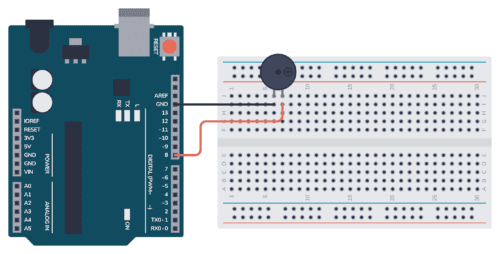

# 수동부저 소리 재생

> [!NOTE]
> 이 문서는 **수동 부저(Passive Buzzer)**를 사용하여 특정 음계를 재생하는 실습에 대해 설명합니다.

## 1. 실습 목표

> `tone()` 함수를 이용하여 수동 부저로 '도레미파솔라시도' 음계를 연주하는 프로그램을 작성합니다.



> 수동 부저 회로 구성 예시

### 준비물

- 아두이노 우노
- 브레드보드
- 수동 부저 (Passive Buzzer)
- 점퍼 와이어

## 2. 수동 부저 vs 능동 부저

- **능동 부저 (Active Buzzer)**: 전원만 연결하면 내장된 회로에 의해 정해진 단일음이 발생합니다. (`digitalWrite()`로 제어)
- **수동 부저 (Passive Buzzer)**: 특정 주파수의 신호를 주어야 소리가 발생하며, 주파수를 바꾸어 다양한 음을 만들 수 있습니다. (`tone()` 함수로 제어)

## 3. 회로 구성

1. 수동 부저의 **양극(+)** 핀 (또는 긴 다리)을 아두이노 디지털 **8번** 핀에 연결합니다.
2. 수동 부저의 **음극(-)** 핀 (또는 짧은 다리)을 아두이노 **GND**에 연결합니다.

## 4. 코드 작성

> 각 음계에 해당하는 주파수 값을 배열에 저장하고, `tone()` 함수를 이용해 순서대로 재생합니다.

```cpp
int buzzerPin = 8;

// 음계별 주파수 (4옥타브 기준)
// 도, 레, 미, 파, 솔, 라, 시, 도
int scale[] = {262, 294, 330, 349, 392, 440, 494, 523};

void setup() {
  pinMode(buzzerPin, OUTPUT);
}

void loop() {
  // '도'부터 순서대로 음계 연주
  for (int i = 0; i < 8; i++) {
    // tone(핀 번호, 주파수, 지속시간(ms));
    tone(buzzerPin, scale[i], 500);
    delay(500); // 다음 음과의 간격
  }

  // 2초간 휴식 후 반복
  delay(2000);
}
```

### `tone()` 함수 사용법

- `tone(pin, frequency)`: 지정된 `pin`에서 `frequency`(Hz)의 소리를 계속 재생합니다.
- `tone(pin, frequency, duration)`: 지정된 `pin`에서 `frequency`(Hz)의 소리를 `duration`(ms)만큼 재생합니다.
- `noTone(pin)`: 지정된 `pin`의 소리 재생을 중지합니다.

### 동작 설명

1. `scale` 배열에 '도'부터 높은 '도'까지 8개의 음계에 해당하는 주파수 값을 저장합니다.
2. `for` 반복문을 사용하여 배열의 첫 번째 값부터 마지막 값까지 순차적으로 접근합니다.
3. `tone()` 함수가 호출되어 `buzzerPin`(8번 핀)에서 해당 주파수(`scale[i]`)의 소리를 0.5초(`500`ms)간 재생합니다.
4. 0.5초의 딜레이 후 다음 음을 연주하며, 모든 음계 연주가 끝나면 2초 쉬고 다시 반복합니다.
