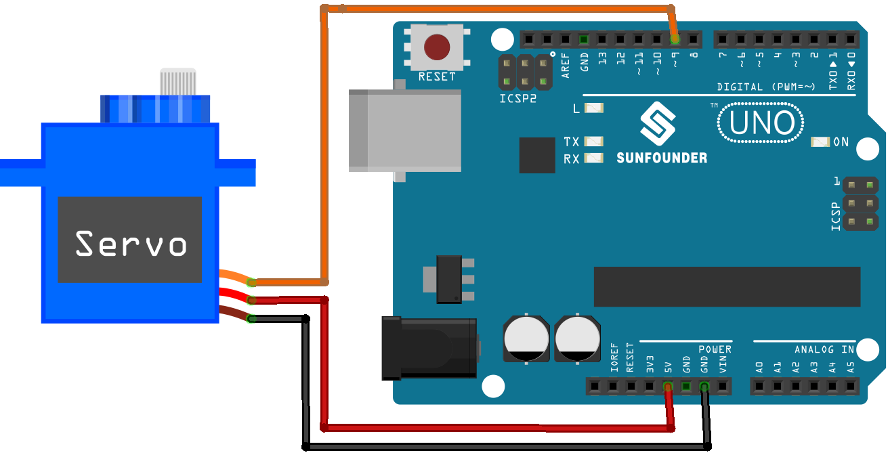

# 서보모터 회전 제어

> [!NOTE]
> 이 문서는 **서보 모터(Servo Motor)**를 제어하여 원하는 각도로 회전시키는 실습에 대해 설명합니다.

## 1. 실습 목표

> 서보 모터 라이브러리를 사용하여 모터를 0도, 90도, 180도로 반복적으로 회전시키는 프로그램을 작성합니다. 단, 180도 이상 회전할 수 없습니다.



> 서보 모터(SG90) 회로 구성 예시

### 준비물

- 아두이노 우노
- 브레드보드
- 서보 모터 (SG90)
- 점퍼 와이어

## 2. 서보 모터란?

> 일반 모터와 달리, 원하는 각도로 정밀하게 회전하고 그 위치를 유지할 수 있는 모터입니다. 로봇 팔, RC카의 조향 장치 등 특정 각도 제어가 필요한 곳에 널리 사용됩니다.

- **제어 방식**: PWM(펄스 폭 변조) 신호의 펄스 폭(길이)에 따라 모터의 각도가 결정됩니다.
- **기본 라이브러리**: 아두이노 IDE에 `Servo.h` 라이브러리가 내장되어 있어 쉽게 제어할 수 있습니다.

## 3. 회로 구성

> 서보 모터는 3개의 선으로 구성되어 있습니다.

| 선 색상                | 핀 이름 | 기능   | 아두이노 연결 핀        |
| ---------------------- | ------- | ------ | ----------------------- |
| **갈색** 또는 **검정** | GND     | 접지   | `GND`                   |
| **빨강**               | VCC     | 전원   | `5V`                    |
| **주황** 또는 **노랑** | Signal  | 신호선 | 디지털 **9번** 핀 (PWM) |

**주의**: 여러 개의 서보 모터를 사용하거나 큰 서보 모터를 사용할 경우, 아두이노의 5V 전원만으로는 부족할 수 있습니다. 이 경우 외부 전원을 별도로 연결해야 합니다.

## 4. 코드 작성

> `Servo.h` 라이브러리를 사용하여 서보 모터를 제어합니다.

```cpp
// 1. 서보 라이브러리 포함
#include <Servo.h>

// 2. 서보 객체 생성
Servo myServo;

int servoPin = 9;

void setup() {
  // 3. 서보 모터를 지정된 핀에 연결
  myServo.attach(servoPin);
}

void loop() {
  // 4. write() 함수로 각도 이동
  myServo.write(0);   // 0도로 이동
  delay(1000);        // 1초 대기

  myServo.write(90);  // 90도로 이동
  delay(1000);        // 1초 대기

  myServo.write(180); // 180도로 이동
  delay(1000);        // 1초 대기
}
```

### `Servo` 라이브러리 주요 함수

- `attach(pin)`: 서보 모터를 제어할 핀을 설정합니다.
- `write(angle)`: 서보 모터를 `angle` (0 ~ 180) 각도로 이동시킵니다.
- `writeMicroseconds(us)`: 펄스 폭을 마이크로초 단위로 직접 설정하여 모터를 제어합니다. (일반적으로 1000: 0도, 1500: 90도, 2000: 180도)
- `read()`: 현재 서보 모터의 각도 값을 반환합니다.
- `detach()`: 서보 모터와 핀의 연결을 해제합니다. 모터에 전력 공급이 중단됩니다.
