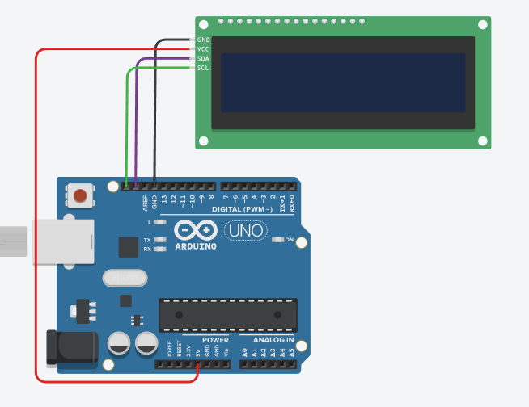

# I2C LCD 화면 출력

> [!NOTE]
> 이 문서는 **I2C 모듈이 부착된 LCD**를 사용하여 원하는 텍스트를 출력하는 실습에 대해 설명합니다.

## 1. 실습 목표

> I2C LCD 라이브러리를 설치하고, 2개의 선만으로 LCD에 "Hello, World!"와 같은 문자열을 출력하는 프로그램을 작성합니다.



> I2C LCD 회로 구성 예시

### 준비물

- 아두이노 우노
- I2C LCD 모듈 (16x2 또는 20x4)
- 점퍼 와이어 (4가닥)

## 2. I2C LCD란?

> 기존의 병렬 방식 LCD는 여러 개의 핀(최소 6개 이상)을 연결해야 해서 회로가 복잡했지만, **I2C 통신 모듈**을 사용하면 단 2개의 통신선(SDA, SCL)과 전원선만으로 LCD를 제어할 수 있어 매우 편리합니다.

- **I2C (Inter-Integrated Circuit)**: 단 2개의 선으로 여러 장치와 통신할 수 있는 직렬 통신 방식
- **SDA (Serial Data)**: 데이터 전송 라인
- **SCL (Serial Clock)**: 클럭 신호 라인

## 3. 라이브러리 설치

1. 아두이노 IDE에서 `스케치` > `라이브러리 포함하기` > `라이브러리 관리`로 이동합니다.
2. 검색창에 `LiquidCrystal I2C`를 검색합니다.
3. **Frank de Brabander**가 만든 `LiquidCrystal_I2C` 라이브러리를 찾아 설치합니다.

## 4. 회로 구성

> I2C LCD 모듈의 4개 핀을 아두이노 우노 보드의 정해진 I2C 핀에 연결합니다.

| I2C LCD 핀 | 아두이노 우노 핀   |
| ---------- | ------------------ |
| GND        | `GND`              |
| VCC        | `5V`               |
| SDA        | `A4` 또는 `SDA` 핀 |
| SCL        | `A5` 또는 `SCL` 핀 |

## 5. 코드 작성

> I2C LCD의 주소(일반적으로 0x27 또는 0x3F)와 크기(16x2)를 설정하고 텍스트를 출력합니다.

```cpp
// 1. 라이브러리 포함
#include <LiquidCrystal_I2C.h>

// 2. LCD 객체 생성 (주소, 열, 행)
// 주소는 LCD 모듈 뒷면의 가변저항 등으로 확인 가능 (일반적으로 0x27)
LiquidCrystal_I2C lcd(0x27, 16, 2);

void setup() {
  // 3. LCD 초기화 및 백라이트 켜기
  lcd.init();
  lcd.backlight();
}

void loop() {
  // 4. 커서 위치 설정 (0, 0) -> 첫 번째 줄, 첫 번째 칸
  lcd.setCursor(0, 0);
  // 5. 텍스트 출력
  lcd.print("Hello, World!");

  // 두 번째 줄에 카운터 출력
  lcd.setCursor(0, 1);
  lcd.print("Count: ");
  lcd.print(millis() / 1000);

  delay(1000);
}
```

### I2C 주소 확인하는 방법

LCD가 정상적으로 동작하지 않는 가장 흔한 원인 중 하나는 I2C 주소가 잘못되었기 때문입니다. LCD 모듈마다 사용되는 칩이 달라 주소가 `0x27`이 아닐 수 있습니다. 이럴 때는 **I2C 스캐너** 코드를 아두이노에 업로드하여 정확한 주소를 직접 확인할 수 있습니다.

#### 1. I2C 스캐너 코드

아래 코드를 아두이노 IDE에 복사하여 붙여넣고, I2C LCD가 연결된 상태에서 업로드합니다.

```cpp
#include <Wire.h>

void setup() {
  Wire.begin();
  Serial.begin(9600);
  while (!Serial); // 시리얼 포트가 열릴 때까지 대기
  Serial.println("\nI2C Scanner");
}

void loop() {
  byte error, address;
  int nDevices;

  Serial.println("Scanning...");

  nDevices = 0;
  for(address = 1; address < 127; address++ ) {
    Wire.beginTransmission(address);
    error = Wire.endTransmission();

    if (error == 0) {
      Serial.print("I2C device found at address 0x");
      if (address < 16) {
        Serial.print("0");
      }
      Serial.print(address, HEX);
      Serial.println("  !");
      nDevices++;
    }
    else if (error == 4) {
      Serial.print("Unknown error at address 0x");
      if (address < 16) {
        Serial.print("0");
      }
      Serial.println(address, HEX);
    }
  }
  if (nDevices == 0) {
    Serial.println("No I2C devices found\n");
  }
  else {
    Serial.println("done\n");
  }
  delay(5000); // 5초마다 다시 스캔
}
```

#### 2. 주소 확인 절차

1.  **회로 연결**: 위에서 설명한 대로 I2C LCD를 아두이노에 연결합니다.
2.  **코드 업로드**: I2C 스캐너 코드를 아두이노에 업로드합니다.
3.  **시리얼 모니터 실행**:
    - 아두이노 IDE의 오른쪽 상단에 있는 돋보기 아이콘(🔍)을 클릭하거나, `툴` > `시리얼 모니터`를 선택합니다.
    - 시리얼 모니터 창의 오른쪽 하단에서 **보드레이트(baud rate)를 `9600`으로 설정**합니다.
4.  **주소 확인**: 시리얼 모니터에 "Scanning..."이라는 메시지와 함께 `0x`로 시작하는 16진수 주소가 나타납니다. 이 주소가 현재 연결된 I2C LCD의 주소입니다.
5.  **코드 수정**: 확인된 주소를 원래 코드의 `LiquidCrystal_I2C lcd(0x27, 16, 2);` 부분에 있는 `0x27` 대신 넣고 다시 업로드하면 LCD가 정상적으로 작동합니다.
