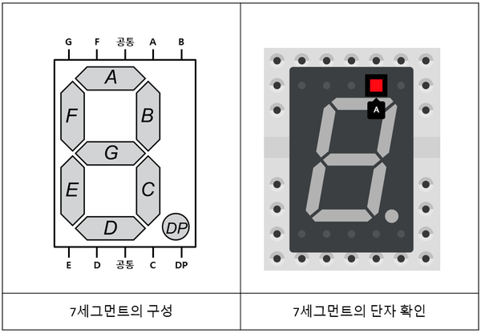
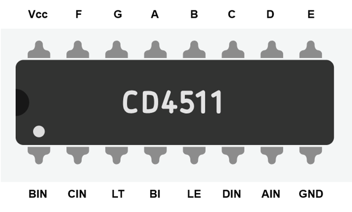
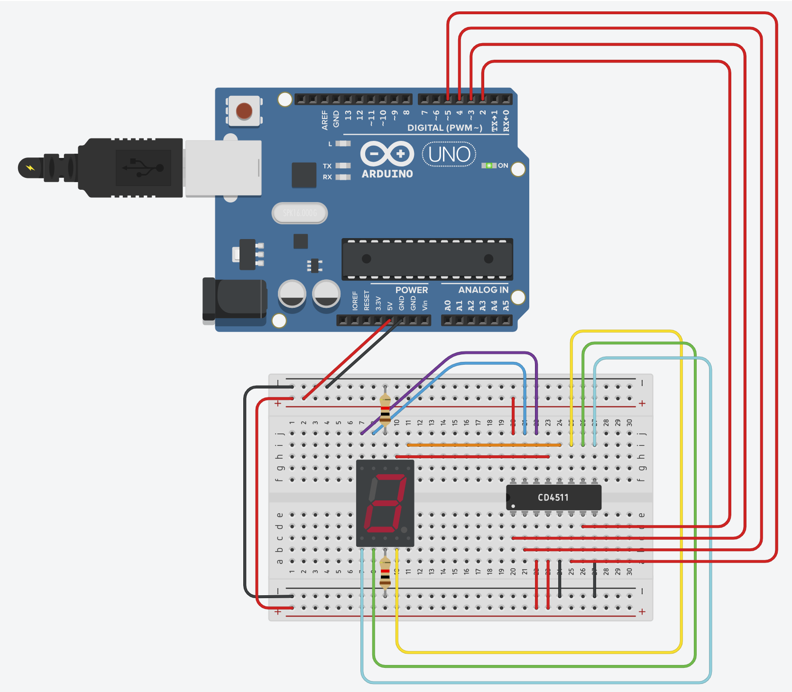

# 7세그먼트와 CD4511 디코더로 숫자 출력

> [!NOTE]
> 이 문서는 **CD4511** BCD-to-7-Segment 디코더를 사용하여 7세그먼트 표시 장치에 숫자를 출력하는 방법에 대해 설명합니다. 이 방법을 사용하면 아두이노 핀 사용을 크게 줄일 수 있습니다.

## 1. 실습 목표

> CD4511 7세그먼트 디코더의 작동 원리를 이해하고, 4개의 아두이노 핀만을 사용하여 0부터 9까지의 숫자를 7세그먼트에 순차적으로 출력하는 프로그램을 작성합니다.

### 준비물



- 아두이노 우노
- 브레드보드
- **CD4511 BCD to 7-Segment 디코더**
- **공통 음극(Common Cathode)** 7세그먼트 표시 장치
- 220Ω 저항 7개
- 점퍼 와이어

## 2. CD4511 7세그먼트 디코더란?

> 7세그먼트를 직접 제어하려면 최소 7~8개의 아두이노 핀이 필요하지만, **CD4511 디코더** IC를 사용하면 4개의 핀만으로 숫자를 제어할 수 있습니다.

- **BCD (Binary Coded Decimal)**: 10진수(0~9)를 4비트의 2진수로 표현하는 방식입니다. 예를 들어, 10진수 `5`는 BCD로 `0101`이 됩니다.
- **CD4511 디코더**: 4비트의 BCD 입력을 받아, 해당 숫자를 7세그먼트에 표시하기 위한 7개의 출력 신호(a~g)로 변환해주는 역할을 합니다. **공통 음극** 7세그먼트와 함께 사용하도록 설계되었습니다.

## 3. 회로 구성

> 아두이노의 디지털 핀 4개를 CD4511 디코더의 BCD 입력 핀(D0~D3)에 연결하고, 디코더의 출력 핀(a~g)을 7세그먼트의 각 핀에 저항을 거쳐 연결합니다.



#### 아두이노와 CD4511 디코더 연결

| 아두이노 핀 | CD4511 핀             | 설명                             |
| :---------- | :-------------------- | :------------------------------- |
| D2          | 7 (D0/A)              | BCD 입력 A (가장 낮은 비트, LSB) |
| D3          | 1 (D1/B)              | BCD 입력 B                       |
| D4          | 2 (D2/C)              | BCD 입력 C                       |
| D5          | 6 (D3/D)              | BCD 입력 D (가장 높은 비트, MSB) |
| 5V          | 16(VDD), 3(LT), 4(BL) | 전원 및 기능 핀                  |
| GND         | 8(VSS), 5(LE)         | 접지 및 기능 핀                  |

- **LT (Lamp Test)**: `LOW`일 때 모든 세그먼트를 켭니다. 정상 작동을 위해 **5V(HIGH)**에 연결합니다.
- **BL (Blanking)**: `LOW`일 때 모든 세그먼트를 끕니다. 정상 작동을 위해 **5V(HIGH)**에 연결합니다.
- **LE (Latch Enable)**: `HIGH`일 때 현재 BCD 입력을 저장(래치)하여 출력을 고정시킵니다. 입력에 따라 출력이 계속 바뀌게 하려면 **GND(LOW)**에 연결합니다.

#### CD4511 디코더와 7세그먼트 연결

- CD4511의 출력 핀 `a`부터 `g`까지(13, 12, 11, 10, 9, 15, 14번 핀)를 각각 220Ω 저항을 거쳐 7세그먼트의 `a`부터 `g` 핀에 연결합니다.
- 7세그먼트의 **공통 음극(COM) 핀**을 **GND**에 연결합니다.



## 4. 코드 작성

> `bitRead()` 함수를 사용하여 숫자의 각 비트를 읽어와 4개의 BCD 핀으로 전송합니다. 디코더가 나머지 복잡한 작업을 처리해줍니다.

```cpp
// CD4511 디코더의 BCD 입력 핀에 연결된 아두이노 핀
const int bcdA = 2; // LSB
const int bcdB = 3;
const int bcdC = 4;
const int bcdD = 5; // MSB

void setup() {
  // BCD 입력 핀들을 출력으로 설정
  pinMode(bcdA, OUTPUT);
  pinMode(bcdB, OUTPUT);
  pinMode(bcdC, OUTPUT);
  pinMode(bcdD, OUTPUT);
}

void loop() {
  // 0부터 9까지 숫자를 1초 간격으로 표시
  for (int number = 0; number <= 9; number++) {
    displayNumber(number);
    delay(1000);
  }
}

// 숫자를 BCD 형태로 디코더에 전송하는 함수
void displayNumber(int number) {
  digitalWrite(bcdA, bitRead(number, 0)); // 1번째 비트 (LSB)
  digitalWrite(bcdB, bitRead(number, 1)); // 2번째 비트
  digitalWrite(bcdC, bitRead(number, 2)); // 3번째 비트
  digitalWrite(bcdD, bitRead(number, 3)); // 4번째 비트 (MSB)
}
```

### 코드 설명

1.  **`displayNumber(int number)` 함수**:
    - `bitRead(number, 0)`: `number`의 0번째 비트(가장 오른쪽) 값을 읽습니다.
    - `digitalWrite(bcdA, ...)`: 읽어온 비트 값(`0` 또는 `1`)을 `bcdA` 핀으로 출력하여 디코더에 BCD 신호를 보냅니다.
    - 이 과정을 4개의 비트에 대해 반복하여 완전한 BCD 코드를 전송합니다.
