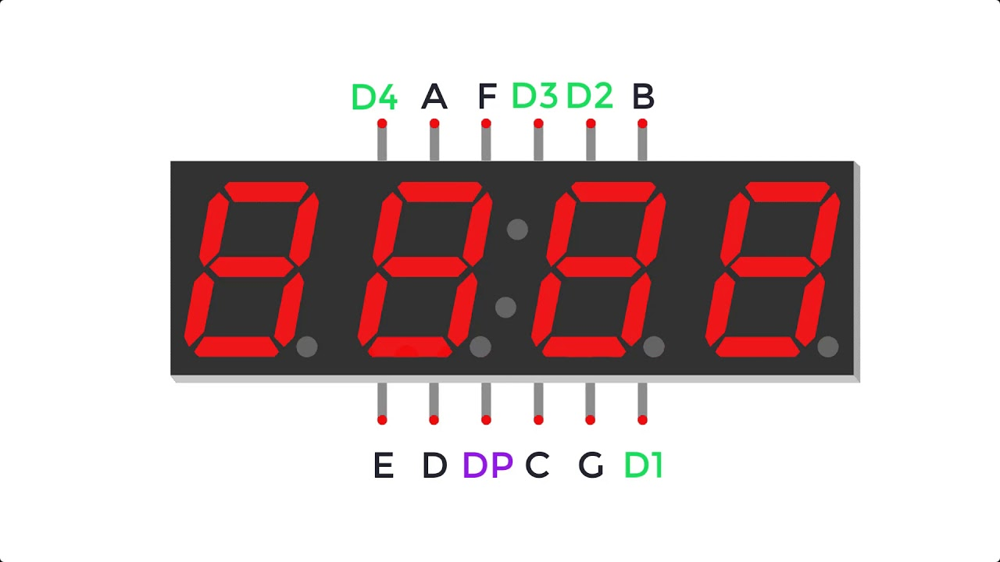
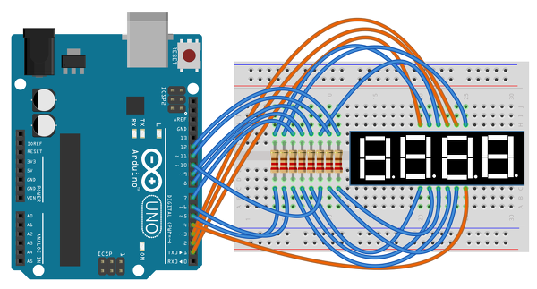

# 4자리 7세그먼트 직접 제어하기 (디코더 없이)

> [!NOTE]
> 이 문서는 디코더 IC 없이 4자리 7세그먼트 표시 장치를 직접 구동하는 **다이나믹 드라이브(Dynamic Drive)** 또는 **멀티플렉싱(Multiplexing)** 기법에 대해 설명합니다. 더 많은 아두이노 핀이 필요하지만, 별도의 디코더 칩 없이 7세그먼트를 제어할 수 있습니다.

## 1. 실습 목표

> 4자리 7세그먼트의 동적 구동 원리를 이해하고, 아두이노 핀을 직접 제어하여 0부터 9999까지의 숫자를 순차적으로 출력하는 프로그램을 작성합니다.

### 준비물



- 아두이노 우노
- 브레드보드
- **공통 음극(Common Cathode)** 4자리 7세그먼트 표시 장치
- 220Ω 저항 8개 (세그먼트용 7개, 자릿수용 1개 - 선택 사항)
- 점퍼 와이어

## 2. 다이나믹 드라이브(동적 구동) 원리

> 4자리 7세그먼트는 4개의 디스플레이가 합쳐진 형태로, 각 세그먼트 핀(a~g)은 모든 자리가 공유하고, 각 자릿수를 켜고 끄는 핀(D1~D4)이 따로 있습니다. 이 자릿수 핀을 매우 빠르게 순차적으로 켜고 끄면서 각 자리에 해당하는 숫자 데이터를 보내면, 우리 눈의 잔상 효과 때문에 모든 숫자가 동시에 켜져 있는 것처럼 보입니다.

1.  첫 번째 자릿수만 켜고, 첫 번째 숫자를 표시합니다.
2.  아주 짧은 시간 후, 첫 번째 자릿수를 끄고 두 번째 자릿수를 켭니다. 그리고 두 번째 숫자를 표시합니다.
3.  이 과정을 마지막 자릿수까지 매우 빠르게 반복합니다.

이 기법을 **멀티플렉싱** 또는 **다이나믹 드라이브**라고 부릅니다.

## 3. 회로 구성

> 7개의 세그먼트 제어 핀과 4개의 자릿수 선택 핀을 아두이노의 디지털 핀에 연결합니다. 여기서는 **공통 음극** 모델을 기준으로 설명합니다.

#### 아두이노와 7세그먼트 연결

| 7세그먼트 핀 | 아두이노 핀 | 설명                                 |
| :----------- | :---------- | :----------------------------------- |
| a ~ g        | D2 ~ D8     | 각 세그먼트 제어 핀 (220Ω 저항 연결) |
| D1 ~ D4      | D9 ~ D12    | 각 자릿수 선택 핀 (공통 음극)        |

- **세그먼트 핀 (a-g)**: 아두이노 디지털 핀에 각각 220Ω 저항을 거쳐 연결합니다.
- **자릿수 선택 핀 (D1-D4)**: 아두이노의 다른 디지털 핀에 직접 연결합니다. (공통 음극 모델의 경우, 이 핀에 LOW 신호를 주면 해당 자릿수가 켜집니다.)



## 4. 코드 작성

> `loop()` 함수 안에서 4개의 자릿수를 순차적으로 빠르게 켜고 끄는 함수를 계속 호출하여 멀티플렉싱을 구현합니다.

```cpp
// 7세그먼트의 각 세그먼트(a-g)에 연결된 아두이노 핀 번호
const int segmentPins[] = {2, 3, 4, 5, 6, 7, 8}; // a, b, c, d, e, f, g

// 7세그먼트의 각 자릿수(D1-D4)를 제어하는 아두이노 핀 번호
const int digitPins[] = {9, 10, 11, 12}; // D1, D2, D3, D4

// 7세그먼트로 숫자를 표시하기 위한 데이터 (0-9)
// {a, b, c, d, e, f, g} - 1:ON, 0:OFF
byte numbers[10][7] = {
  {1, 1, 1, 1, 1, 1, 0}, // 0
  {0, 1, 1, 0, 0, 0, 0}, // 1
  {1, 1, 0, 1, 1, 0, 1}, // 2
  {1, 1, 1, 1, 0, 0, 1}, // 3
  {0, 1, 1, 0, 0, 1, 1}, // 4
  {1, 0, 1, 1, 0, 1, 1}, // 5
  {1, 0, 1, 1, 1, 1, 1}, // 6
  {1, 1, 1, 0, 0, 0, 0}, // 7
  {1, 1, 1, 1, 1, 1, 1}, // 8
  {1, 1, 1, 1, 0, 1, 1}  // 9
};

long previousMillis = 0;
int number_to_display = 0;

void setup() {
  // 모든 세그먼트 핀을 출력으로 설정
  for (int i = 0; i < 7; i++) {
    pinMode(segmentPins[i], OUTPUT);
  }
  // 모든 자릿수 핀을 출력으로 설정
  for (int i = 0; i < 4; i++) {
    pinMode(digitPins[i], OUTPUT);
    digitalWrite(digitPins[i], HIGH); // 공통 음극이므로 HIGH로 꺼둠
  }
}

void loop() {
  // 1초마다 표시할 숫자를 1씩 증가 (Non-blocking delay)
  unsigned long currentMillis = millis();
  if (currentMillis - previousMillis >= 1000) {
    previousMillis = currentMillis;
    number_to_display++;
    if (number_to_display > 9999) {
      number_to_display = 0;
    }
  }

  // 계속해서 숫자를 화면에 표시 (멀티플렉싱)
  displayNumber(number_to_display);
}

// 숫자를 4자리 7세그먼트에 표시하는 함수
void displayNumber(int num) {
    showDigit(num / 1000, 0);      // 천의 자리
    showDigit((num / 100) % 10, 1); // 백의 자리
    showDigit((num / 10) % 10, 2);  // 십의 자리
    showDigit(num % 10, 3);         // 일의 자리
}

// 특정 자릿수에 특정 숫자를 표시하는 함수 (1회)
void showDigit(int num, int digit) {
  // 모든 자릿수 끄기 (Cathode OFF)
  for (int i = 0; i < 4; i++) {
    digitalWrite(digitPins[i], HIGH);
  }

  // 해당 숫자에 맞는 세그먼트 켜기
  for (int i = 0; i < 7; i++) {
    digitalWrite(segmentPins[i], numbers[num][i]);
  }

  // 해당 자릿수만 켜기 (Cathode ON)
  digitalWrite(digitPins[digit], LOW);

  delay(2); // 잔상 효과를 위한 짧은 지연
}
```

### 코드 설명

1.  **`segmentPins[]`, `digitPins[]`**: 세그먼트와 자릿수 제어에 사용될 아두이노 핀 번호를 배열로 관리합니다.
2.  **`numbers[][]`**: 0~9 숫자를 표시하기 위한 7세그먼트의 ON/OFF 상태(1/0)를 미리 정의한 2차원 배열입니다.
3.  **`loop()`**: `millis()` 함수를 사용하여 1초 간격으로 표시할 숫자를 업데이트합니다. `delay()`를 사용하지 않아 숫자가 바뀌는 동안에도 `displayNumber()` 함수가 계속 호출되어 디스플레이가 깜빡이지 않습니다.
4.  **`displayNumber(int num)`**: 표시할 숫자를 각 자릿수로 분리하여 `showDigit()` 함수를 순서대로 호출합니다. `loop()`가 매우 빠르게 반복되므로 이 함수도 계속 호출되어 4개의 자릿수가 빠르게 순환하며 켜집니다.
5.  **`showDigit(int num, int digit)`**: 특정 자릿수(`digit`)에 특정 숫자(`num`)를 한 번 표시하는 역할을 합니다. 모든 자릿수를 껐다가 해당 자릿수만 켜고, 숫자 데이터를 세그먼트 핀으로 출력합니다. `delay(2)`는 잔상 효과를 만들기에 충분한 최소한의 시간입니다.
