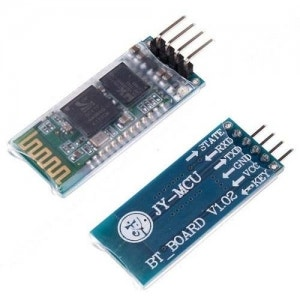
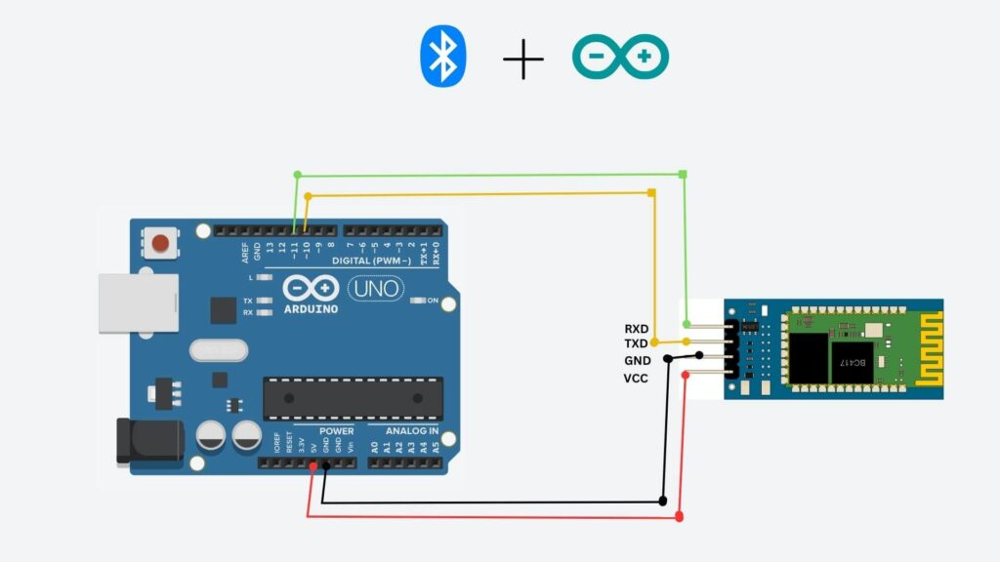

# HC-06 블루투스 모듈로 무선 시리얼 통신

> [!NOTE]
> 이 문서는 **HC-06 블루투스 모듈**을 사용하여 아두이노와 스마트폰 또는 PC 간에 무선으로 데이터를 주고받는 방법에 대해 설명합니다. 이를 통해 유선 연결 없이 원격으로 아두이노를 제어하거나 모니터링할 수 있습니다.

## 1. 실습 목표

> HC-06 블루투스 모듈의 작동 원리를 이해하고, 아두이노와 스마트폰 앱 간에 텍스트 메시지를 무선으로 송수신하는 프로그램을 작성합니다.

### 준비물



- 아두이노 우노
- 브레드보드
- **HC-06 블루투스 모듈**
- 스마트폰 (블루투스 시리얼 통신 앱 설치)
- 점퍼 와이어

## 2. HC-06 블루투스 모듈이란?

> **HC-06**은 아두이노와 같은 마이크로컨트롤러가 다른 장치와 무선으로 통신할 수 있게 해주는 **슬레이브(Slave) 전용** 블루투스 모듈입니다.

- **시리얼 통신(UART)**: HC-06은 아두이노와 시리얼(TX/RX) 핀을 통해 통신합니다. 아두이노가 보낸 데이터는 블루투스를 통해 무선으로 전송되고, 무선으로 수신된 데이터는 아두이노의 시리얼 핀으로 전달됩니다.
- **슬레이브 모드**: HC-06은 항상 다른 장치(마스터)의 연결 요청을 기다리는 슬레이브 장치로만 작동합니다. 스마트폰이나 PC가 마스터가 되어 HC-06에 연결을 시도합니다.
- **기본 설정**: 일반적으로 HC-06 모듈은 `9600`의 통신 속도(Baud Rate), `HC-06` 또는 `linvor`과 같은 장치 이름, `1234`의 페어링 PIN 코드를 가집니다.

## 3. 회로 구성

> 아두이노의 **SoftwareSerial** 핀을 사용하여 블루투스 모듈과 연결합니다. 이렇게 하면 USB를 통한 시리얼 모니터와 블루투스 통신을 동시에 사용할 수 있습니다.



#### 아두이노와 HC-06 모듈 연결

| 아두이노 핀 | HC-06 핀 | 설명                               |
| :---------- | :------- | :--------------------------------- |
| 5V          | VCC      | 5V 전원 공급                       |
| GND         | GND      | 접지                               |
| D2 (RX)     | TXD      | 블루투스 모듈이 보낸 데이터를 수신 |
| D3 (TX)     | RXD      | 블루투스 모듈에게 데이터를 송신    |

- **주의**: 블루투스 모듈의 TXD(송신) 핀은 아두이노의 RX(수신) 핀에, RXD(수신) 핀은 아두이노의 TX(송신) 핀에 교차하여 연결해야 합니다.
- **SoftwareSerial**: 아두이노 우노의 공식 시리얼 핀(0, 1번) 대신 다른 디지털 핀(예: 2, 3번)을 시리얼 통신에 사용하게 해주는 라이브러리입니다.

## 4. 코드 작성

> `SoftwareSerial` 라이브러리를 사용하여 블루투스 모듈과 통신합니다. 시리얼 모니터에 입력한 내용은 스마트폰으로, 스마트폰에서 보낸 내용은 시리얼 모니터로 출력됩니다.

```cpp
#include <SoftwareSerial.h>

// 블루투스 모듈에 연결될 가상 시리얼 포트 생성 (RX, TX)
SoftwareSerial bluetooth(2, 3); // 아두이노 2번(RX), 3번(TX) 핀 사용

void setup() {
  // PC와 연결되는 시리얼 모니터 시작
  Serial.begin(9600);
  Serial.println("시리얼 모니터 준비 완료");

  // HC-06 블루투스 모듈과 통신 시작
  bluetooth.begin(9600);
  Serial.println("블루투스 모듈 준비 완료");
}

void loop() {
  // 블루투스 모듈로부터 데이터가 들어오면, 시리얼 모니터에 출력
  if (bluetooth.available()) {
    char data = bluetooth.read();
    Serial.print("수신: ");
    Serial.write(data);
  }

  // 시리얼 모니터로부터 데이터가 들어오면, 블루투스 모듈로 전송
  if (Serial.available()) {
    char data = Serial.read();
    Serial.print("송신: ");
    Serial.write(data);
    bluetooth.write(data);
  }
}
```

### 코드 설명

1.  **`#include <SoftwareSerial.h>`**: SoftwareSerial 라이브러리를 코드에 포함시킵니다.
2.  **`SoftwareSerial bluetooth(2, 3);`**: 2번 핀을 RX로, 3번 핀을 TX로 사용하는 `bluetooth`라는 이름의 가상 시리얼 포트를 생성합니다.
3.  **`bluetooth.begin(9600);`**: HC-06 모듈의 기본 통신 속도인 9600 bps로 블루투스 통신을 시작합니다.
4.  **`if (bluetooth.available())`**: 블루투스를 통해 수신된 데이터가 있는지 확인합니다.
5.  **`if (Serial.available())`**: 시리얼 모니터에 사용자가 입력한 데이터가 있는지 확인합니다.
6.  **`read()` / `write()`**: 한쪽에서 데이터를 읽어(`read`) 다른 한쪽으로 써주는(`write`) 방식으로 양방향 통신을 구현합니다.

## 5. 스마트폰과 연결하여 테스트

1.  아두이노에 코드를 업로드하고 전원을 연결하면 HC-06 모듈의 LED가 깜빡입니다. (연결 대기 상태)
2.  스마트폰의 블루투스 설정 메뉴로 이동하여 'HC-06' 장치를 검색하고 페어링합니다. PIN 코드 `1234`를 입력합니다.
3.  Google Play Store 등에서 **'Serial Bluetooth Terminal'** 과 같은 앱을 설치하고 실행합니다.
4.  앱에서 페어링된 'HC-06' 장치에 연결합니다. 연결에 성공하면 모듈의 LED가 계속 켜져 있는 상태로 바뀝니다.
5.  이제 앱의 터미널 화면에 메시지를 입력하고 보내면 아두이노 시리얼 모니터에 해당 메시지가 나타나고, 반대로 시리얼 모니터에 메시지를 입력하면 스마트폰 앱 화면에 나타나는 것을 확인할 수 있습니다.
