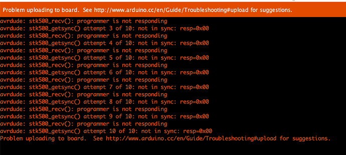

# 코드 업로드 오류

> [!WARNING]
> 이 문서는 **아두이노 코드 업로드 시 발생할 수 있는 일반적인 오류**와 해결 방법에 대해 설명합니다.

## 1. 오류 현상

- 아두이노 IDE 하단 콘솔 창에 주황색 글씨로 오류 메시지가 나타납니다.
- `avrdude: stk500_getsync() not in sync: resp=0x00`
- `avrdude: ser_open(): can't open device "\\.\COMx": The system cannot find the file specified.`
- `Problem uploading to board.` 등의 메시지가 표시됩니다.

> 대표적인 업로드 오류 메시지

## 2. 주요 원인 및 해결 방법

### 원인 1: 보드 또는 포트 설정 문제

> IDE에 선택된 보드나 포트가 실제 연결된 아두이노와 다를 경우 발생합니다.

**해결 방법**

1. **올바른 보드 선택**: `툴` > `보드` 메뉴에서 사용 중인 아두이노 보드(예: `Arduino Uno`)가 정확히 선택되었는지 확인합니다.
2. **올바른 포트 선택**: `툴` > `포트` 메뉴에서 아두이노가 연결된 COM 포트가 올바르게 선택되었는지 확인합니다. 포트를 잘 모를 경우, 아두이노를 분리했다가 다시 연결했을 때 나타나는 포트를 선택합니다.

### 원인 2: 케이블 불량 또는 연결 불량

> 사용하는 USB 케이블이 데이터 전송 기능이 없는 충전 전용 케이블이거나, 케이블 내부가 손상된 경우, 또는 USB 포트와의 연결이 헐거운 경우 발생합니다.

**해결 방법**

1. **데이터 통신용 케이블 사용**: 다른 장치와 데이터 통신이 정상적으로 되었던 USB 케이블로 교체해 봅니다.
2. **USB 포트 변경**: PC의 다른 USB 포트에 연결해 봅니다. (특히 USB 허브를 사용 중이라면 PC 본체의 포트에 직접 연결)
3. **연결 상태 확인**: 케이블이 아두이노와 PC에 단단히 연결되었는지 확인합니다.

### 원인 3: 드라이버 설치 문제

> CH340/CH341 칩을 사용하는 일부 저렴한 아두이노 호환 보드는 PC와 통신하기 위해 별도의 드라이버 설치가 필요합니다.

**해결 방법**

1. **장치 관리자 확인**: `Windows 키 + X` > `장치 관리자`를 열고 `포트 (COM & LPT)` 항목을 확인합니다. `USB-SERIAL CH340` 또는 알 수 없는 장치로 표시된다면 드라이버가 필요합니다.
2. **드라이버 검색 및 설치**: 구글에서 `CH340 driver`를 검색하여 자신의 운영체제에 맞는 드라이버를 다운로드하고 설치합니다.

### 원인 4: 다른 프로그램이 포트 사용 중

> 시리얼 모니터, 다른 통신 프로그램, 3D 프린터 제어 프로그램 등이 아두이노가 연결된 COM 포트를 이미 사용하고 있을 경우 발생합니다.

**해결 방법**

1. **시리얼 모니터 닫기**: 아두이노 IDE의 시리얼 모니터가 열려 있다면 닫고 다시 업로드를 시도합니다.
2. **관련 프로그램 종료**: 해당 COM 포트를 사용할 가능성이 있는 다른 모든 프로그램을 종료하고 다시 시도합니다.
