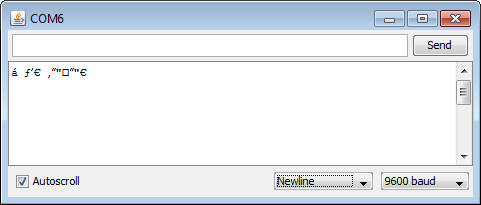

# 시리얼 모니터 값이 이상하게 나오는 경우

> [!WARNING]
> 이 문서는 **아두이노 시리얼 모니터에 출력되는 값이 깨지거나 알아볼 수 없는 문자**로 나타나는 문제의 해결 방법에 대해 설명합니다.

## 1. 오류 현상

- 시리얼 모니터에 `Hello, World!`와 같은 정상적인 텍스트 대신 `⸮%@⸮&⸮` 와 같이 의미를 알 수 없는 문자들이 출력됩니다.
- 숫자 값이 예상과 전혀 다른 큰 값이나 음수 값으로 출력됩니다.



> 시리얼 모니터 글자 깨짐 현상

## 2. 주요 원인 및 해결 방법

### 원인 1: 통신 속도(Baud Rate) 불일치

> 아두이노 코드에 설정된 통신 속도와 시리얼 모니터 창에 설정된 통신 속도가 일치하지 않는 것이 가장 흔한 원인입니다.

**해결 방법**

1. **코드의 통신 속도 확인**: `setup()` 함수 안에 있는 `Serial.begin()` 함수의 인자 값을 확인합니다. 일반적으로 `Serial.begin(9600);` 과 같이 설정되어 있습니다.

   ```cpp
   void setup() {
     Serial.begin(9600); // 통신 속도를 9600 bps로 설정
   }
   ```

2. **시리얼 모니터 통신 속도 설정**: 아두이노 IDE의 시리얼 모니터 창 우측 하단에 있는 드롭다운 메뉴를 클릭하여 코드에 설정된 값과 **동일한 값 (예: 9600 baud)**으로 맞춰줍니다.

3. **추가 확장 모듈의 통신 속도 설정**: 일부 모듈(블루투스 등)은 별도로 통신 속도를 지정해줘야합니다. 이때 모듈의 통신 속도를 `Serial.begin()`에서 입력한 숫자와 동일하게 맞추어 설정해줍니다. (모듈의 통신 속도를 어떻게 변경하는지는 구글에 검색 필요)

### 원인 2: 불안정한 회로 연결

> 센서나 다른 부품의 연결이 헐겁거나 잘못 연결된 경우, 전기적으로 불안정한 신호가 아두이노에 입력되어 시리얼 통신에 영향을 줄 수 있습니다.

**해결 방법**

1. **전원 및 접지(GND) 확인**: 모든 부품의 VCC와 GND가 올바르게 연결되었는지 다시 확인합니다.
2. **점퍼 와이어 연결 확인**: 브레드보드나 핀에 꽂힌 점퍼 와이어가 헐겁지 않은지 확인하고, 의심되는 경우 다른 선으로 교체해 봅니다.
3. **회로 단순화**: 문제가 발생할 경우, 연결된 부품을 최소화하여 어느 부분에서 문제가 발생하는지 범위를 좁혀 나갑니다.

### 원인 3: `delay()` 함수의 부재

> `loop()` 함수 안에 `delay()` 없이 너무 빠른 속도로 `Serial.print()`를 호출하면, 아두이노와 PC 간의 데이터 처리 속도 차이로 인해 데이터가 누락되거나 깨져 보일 수 있습니다.

**해결 방법**

- `loop()` 함수 마지막에 적절한 `delay()`를 추가하여 약간의 지연 시간을 줍니다.

  ```cpp
  void loop() {
    int sensorValue = analogRead(A0);
    Serial.println(sensorValue);
    delay(100); // 0.1초 정도의 딜레이를 주어 안정적인 출력 유도
  }
  ```
