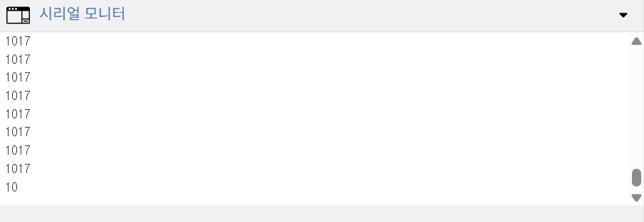

# 센서 값이 변하지 않는 경우

> [!WARNING]
> 이 문서는 **센서를 연결했지만 시리얼 모니터의 값이 고정되어 있거나, 0 또는 1023과 같은 극단적인 값만 나오는 문제**의 해결 방법에 대해 설명합니다.

## 1. 오류 현상

- 조도 센서를 손으로 가리거나 빛을 비춰도 `analogRead()` 값이 거의 변하지 않습니다.
- 초음파 센서 앞에 물체를 가까이하거나 멀리해도 측정되는 거리가 항상 동일합니다.
- 센서 값이 0, 1023(아날로그) 또는 0, 1(디지털) 등 특정 값에 고정되어 있습니다.

> 센서 값이 1017으로 고정되어 변하지 않는 모습

## 2. 주요 원인 및 해결 방법

### 원인 1: 핀 번호 설정 오류

> 코드에 선언된 핀 번호와 실제 센서가 연결된 아두이노의 핀 번호가 일치하지 않는 경우입니다.

**해결 방법**

- **코드와 실제 회로 대조**: 코드 상단의 `int sensorPin = A0;` 와 같은 핀 번호 선언부와, 점퍼 와이어가 실제로 꽂힌 아두이노 보드의 핀 번호가 일치하는지 꼼꼼히 확인합니다.

### 원인 2: 전원/그라운드 연결 누락 또는 불량

> 센서에 VCC(5V) 또는 GND(접지)가 제대로 연결되지 않으면 센서가 정상적으로 동작하지 않아 불안정한 값을 출력합니다.

**해결 방법**

1. **VCC/GND 연결 확인**: 센서 모듈의 VCC 핀이 아두이노 5V에, GND 핀이 아두이노 GND에 잘 연결되었는지 확인합니다.
2. **브레드보드 전원 라인 확인**: 브레드보드의 전원 버스(+/- 라인)를 사용했다면, 아두이노의 5V/GND가 브레드보드의 전원 버스에 잘 연결되었는지 확인합니다. 브레드보드에 따라 중앙에서 전원 라인이 끊어진 경우도 있으니 주의합니다.

### 원인 3: 회로 구성 오류 (특히 아날로그 센서)

> 조도 센서, 가변 저항과 같은 아날로그 센서는 전압 분배 법칙을 이용하기 위해 풀업 또는 풀다운 저항과 함께 사용해야 합니다. 이 저항이 없거나 잘못 연결되면 값이 한쪽으로 치우쳐 나옵니다.

**해결 방법**

- **회로도 재확인**: 해당 센서의 데이터시트나 정상적으로 동작하는 회로 예시를 다시 보고, 자신의 회로에 풀업/풀다운 저항이 올바르게 연결되었는지 확인합니다. (예: 조도 센서의 경우, 신호선과 GND 사이에 10kΩ 저항 연결)

### 원인 4: 센서 자체의 손상

> 드물지만, 정전기나 잘못된 전압 인가 등으로 인해 센서 자체가 물리적으로 손상되었을 수 있습니다.

**해결 방법**

1. **가장 간단한 예제 실행**: 해당 센서를 사용하는 가장 기본적인 예제 코드를 실행하여 센서의 동작 여부를 최소한의 환경에서 테스트합니다.
2. **동일한 다른 센서로 교체**: 가능하다면, 동일한 종류의 다른 센서로 교체하여 테스트해 봅니다. 교체 후 정상 동작한다면 기존 센서의 고장일 가능성이 높습니다.
