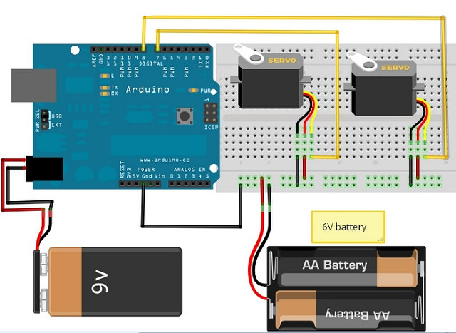

# 서보모터 떨림 또는 움직이지 않음

> [!WARNING]
> 이 문서는 **서보 모터가 특정 각도로 이동한 후 부르르 떨거나, 전혀 움직이지 않거나, 힘없이 흔들리는 문제**의 해결 방법에 대해 설명합니다.

## 1. 오류 현상

- `myServo.write(90);` 명령 후, 모터가 90도 위치에서 계속 "드르륵" 또는 "윙" 하는 소리를 내며 미세하게 떨립니다.
- 서보 모터가 지정된 각도로 이동하지 않고 힘없이 축 늘어집니다.
- 여러 개의 서보 모터를 연결하자 모든 모터가 제대로 동작하지 않습니다.

> 전원 부족으로 인해 떨리는 서보 모터

## 2. 주요 원인 및 해결 방법

### 원인 1: 전원 공급 부족 (가장 흔한 원인)

> 서보 모터는 위치를 유지하기 위해 계속해서 전류를 소모합니다. 아두이노 보드의 5V 레귤레이터는 공급할 수 있는 전류(약 500mA)에 한계가 있어, 서보 모터 1~2개를 겨우 감당하거나 그마저도 부족한 경우가 많습니다.

**해결 방법**

1. **외부 전원 사용**: 서보 모터를 위한 **별도의 5V 전원(예: 5V 2A 어댑터, AA 건전지 4개 팩 등)**을 사용하는 것이 가장 확실한 해결책입니다.
2. **외부 전원 연결 시 주의사항**:
   - 외부 전원의 **+** 극을 서보 모터의 VCC(빨간색 선)에 연결합니다.
   - 외부 전원의 **-** 극(GND)을 서보 모터의 GND(갈색 선) **그리고 아두이노의 GND 핀**에 **반드시 함께** 연결해야 합니다. (→ **공통 접지**)
   - 아두이노의 신호선(주황색 선)만 서보 모터의 신호 핀에 연결합니다.

> 서보 모터에 외부 전원을 연결한 회로 예시

### 원인 2: 잘못된 핀 연결

> 서보 모터 제어를 위한 PWM 신호는 모든 디지털 핀에서 생성할 수 있지만, `Servo.h` 라이브러리는 특정 타이머와 연결된 핀에서 가장 안정적으로 동작합니다. (Uno 기준 대부분의 핀에서 잘 동작함)

**해결 방법**

- **PWM 지원 핀 사용**: 가급적 디지털 핀 중 `~` 표시가 있는 PWM 핀(3, 5, 6, 9, 10, 11)에 연결하는 것을 권장합니다.
- **라이브러리 attach 확인**: `myServo.attach(pinNumber);` 코드의 `pinNumber`가 실제 신호선이 연결된 핀 번호와 일치하는지 다시 확인합니다.

### 원인 3: `delay()` 함수와 `Servo` 라이브러리의 충돌

> `Servo.h` 라이브러리는 내부적으로 타이머를 사용하여 PWM 신호를 만듭니다. 매우 긴 `delay()` 함수(수 초 이상)나 타이머를 직접 제어하는 다른 라이브러리와 함께 사용할 경우, `Servo` 라이브러리의 동작이 방해받아 떨림이 발생할 수 있습니다.

**해결 방법**

1. **`delay()` 최소화**: 코드 내의 불필요하게 긴 `delay()`를 줄이거나, `millis()` 함수를 사용한 비동기 방식으로 코드를 변경하는 것을 고려합니다.
2. **라이브러리 충돌 확인**: 서보 모터 외에 다른 라이브러리(특히 소리를 다루거나, 적외선 통신을 하는 라이브러리)를 사용 중이라면, 해당 라이브러리와 `Servo.h`의 타이머 충돌 여부를 검색해 봅니다.
