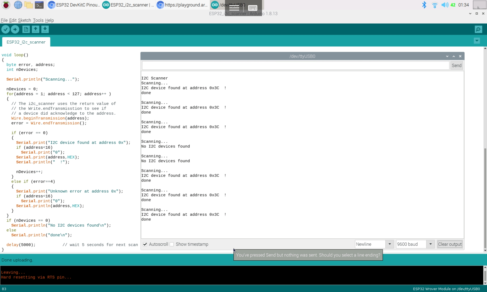

# I2C 장치(LCD 등) 화면이 안 나오는 경우

> [!WARNING]
> 이 문서는 **I2C 통신을 사용하는 LCD 등의 장치가 동작하지 않거나 화면에 아무것도 표시되지 않는 문제**의 해결 방법에 대해 설명합니다.

## 1. 오류 현상

- I2C LCD에 `lcd.print()` 명령을 실행해도 아무 글자도 나타나지 않습니다.
- 백라이트는 켜져 있지만, 글씨가 보이지 않습니다.
- 백라이트조차 켜지지 않습니다.
- I2C 통신을 사용하는 다른 센서(자이로 센서, 기압 센서 등)의 값이 읽어지지 않습니다.

## 2. 주요 원인 및 해결 방법

### 원인 1: SDA/SCL 핀 연결 오류

> I2C 통신은 정해진 특정 핀(SDA, SCL)으로만 가능합니다. 이 핀을 잘못 연결하면 통신 자체가 이루어지지 않습니다.

**해결 방법**

- **보드별 I2C 핀 확인**: 사용 중인 아두이노 보드의 I2C 핀 위치를 정확히 확인하고 연결합니다.
  - **Arduino Uno**: `A4` (SDA), `A5` (SCL)
  - **Arduino Mega**: `20` (SDA), `21` (SCL)
  - **Arduino Nano**: `A4` (SDA), `A5` (SCL)
- **SDA, SCL 교차 연결 확인**: 장치의 SDA는 아두이노의 SDA에, SCL은 아두이노의 SCL에 연결되었는지 확인합니다. (간혹 반대로 연결하는 실수 발생)

### 원인 2: 잘못된 I2C 주소 사용

> 모든 I2C 장치는 고유한 주소(Address)를 가집니다. 코드에 설정된 주소와 실제 장치의 주소가 다르면 장치를 찾을 수 없어 동작하지 않습니다.

**해결 방법**

1. **I2C 스캐너 실행**: 인터넷에서 `I2C Scanner` 예제 코드를 찾아 아두이노에 업로드합니다.
2. **시리얼 모니터 확인**: 시리얼 모니터를 열어 스캔된 장치의 주소를 확인합니다. (`I2C device found at address 0x27` 과 같은 메시지 출력)
3. **코드에 주소 반영**: 확인된 주소를 `LiquidCrystal_I2C lcd(0x27, 16, 2);` 와 같이 코드에 정확하게 입력합니다. (I2C LCD 모듈은 보통 `0x27` 또는 `0x3F` 주소를 가집니다.)

> I2C 스캐너를 통해 장치 주소를 확인하는 모습

### 원인 3: 라이브러리 미설치 또는 충돌

> 해당 I2C 장치를 제어하기 위한 라이브러리가 없거나, 다른 라이브러리와 충돌하는 경우 문제가 발생할 수 있습니다.

**해결 방법**

- **필수 라이브러리 설치**: 장치 제조사나 데이터시트에서 권장하는 라이브러리를 아두이노 IDE의 라이브러리 매니저를 통해 정확히 설치했는지 확인합니다. (예: I2C LCD의 경우 `LiquidCrystal_I2C`)
- **라이브러리 예제 실행**: 설치한 라이브러리에 포함된 기본 예제 코드를 실행하여 하드웨어와 라이브러리의 기본적인 동작 여부를 먼저 확인합니다.

### 원인 4: LCD 명암 조절 문제 (LCD 한정)

> I2C LCD 모듈 뒷면에는 파란색 사각형 모양의 **가변 저항**이 있습니다. 이 저항은 화면의 명암(Contrast)을 조절하는 역할을 합니다.

**해결 방법**

- **드라이버로 저항 조절**: 작은 십자 드라이버를 사용하여 이 가변 저항을 천천히 좌우로 돌려보면서 글씨가 선명하게 보이는 지점을 찾습니다. 저항이 한쪽으로 끝까지 돌아가 있으면 글씨가 너무 희미하거나 너무 진해서 보이지 않을 수 있습니다.
